# RaftKV Architecture Documentation

> **RaftKV (Codename: Flotilla)** - A production-grade distributed key-value store built with the Raft consensus algorithm for strong consistency and high availability.

## Table of Contents

- [Executive Summary](#executive-summary)
- [System Architecture](#system-architecture)
- [Core Components](#core-components)
- [Data Flow](#data-flow)
- [Deployment](#deployment)
- [Performance](#performance)
- [Security](#security)
- [Monitoring](#monitoring)
- [Operations](#operations)

---

## Executive Summary

### Key Features

- **Distributed Consensus**: Raft algorithm for leader election and log replication
- **Strong Consistency**: Linearizable reads/writes with automatic failover
- **High Availability**: Fault-tolerant cluster (survives minority node failures)
- **Security**: TLS/mTLS encryption, JWT authentication, RBAC authorization
- **Performance**: Batched writes (200K ops/sec), LRU caching (5x faster reads)
- **Observability**: Prometheus metrics, structured logging, Grafana dashboards
- **Flexible Deployment**: Single-node, 3-node cluster, or Docker Compose

### Project Statistics

| Metric             | Value                                        |
| ------------------ | -------------------------------------------- |
| **Lines of Code**  | ~21,000 (Go, including tests)                |
| **Core Code**      | ~14,000 (excluding tests)                    |
| **Test Functions** | 172 across 21 test files                     |
| **Dependencies**   | HashiCorp Raft, Gorilla Mux, Prometheus, Zap |
| **API Protocols**  | HTTP REST, gRPC                              |
| **Authentication** | JWT, API Keys                                |
| **Authorization**  | RBAC (admin/write/read)                      |

---

## System Architecture

### High-Level Overview

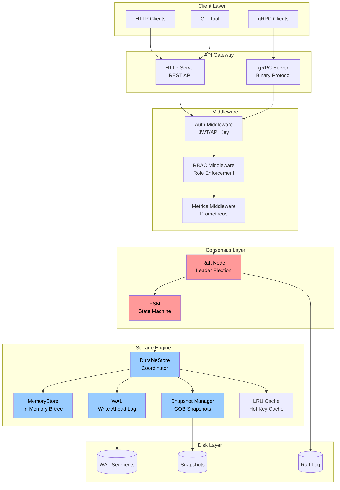

### Component Hierarchy

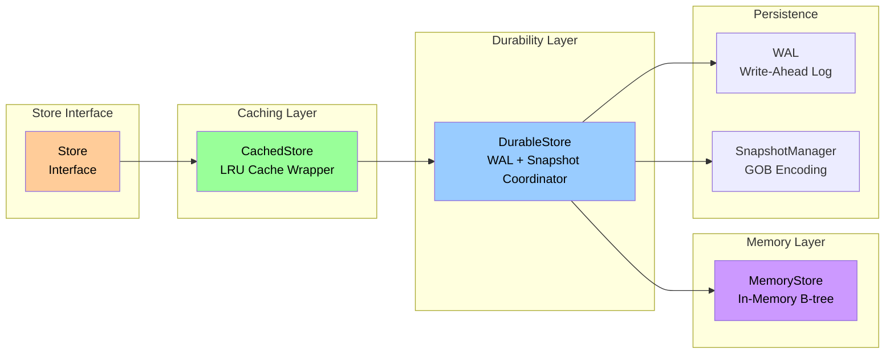

### Project Structure

```
raftkv/
├── cmd/
│   ├── kvstore/              # Server binary
│   │   └── main.go          # Entry point (349 lines)
│   └── kvcli/               # CLI client
│       └── main.go
│
├── internal/                 # Core implementation
│   ├── config/              # Multi-source configuration
│   │   └── config.go        # (387 lines)
│   │
│   ├── storage/             # Storage engine
│   │   ├── store.go         # Interface (38 lines)
│   │   ├── memory_store.go  # In-memory B-tree
│   │   ├── durable_store.go # WAL + snapshot coordinator (506 lines)
│   │   ├── wal.go           # Write-ahead log (658 lines)
│   │   ├── wal_batch.go     # Batched writes (10x speedup)
│   │   ├── snapshot.go      # GOB snapshots
│   │   ├── cache.go         # LRU cache
│   │   └── cached_store.go  # Cache wrapper
│   │
│   ├── consensus/           # Raft consensus
│   │   ├── raft.go         # Raft wrapper (461 lines)
│   │   └── fsm.go          # State machine (184 lines)
│   │
│   ├── server/              # API servers
│   │   ├── http.go         # HTTP server (416 lines)
│   │   ├── raft_http.go    # Raft-aware HTTP
│   │   ├── grpc.go         # gRPC server
│   │   ├── auth_handlers.go # Auth endpoints
│   │   └── middleware.go   # Middleware pipeline
│   │
│   ├── auth/                # Authentication & authorization
│   │   ├── user.go         # User management
│   │   ├── apikey.go       # API key handling
│   │   ├── jwt.go          # JWT tokens
│   │   ├── middleware.go   # Auth middleware (161 lines)
│   │   └── types.go        # RBAC roles
│   │
│   ├── security/            # TLS/mTLS
│   │   └── tls.go          # Certificate management
│   │
│   └── observability/       # Monitoring & logging
│       ├── logger.go        # Structured logging (Zap)
│       └── metrics.go       # Prometheus metrics (198 lines)
│
├── pkg/                     # Public libraries
│   └── client/             # Client SDK
│
├── api/                     # API definitions
│   └── proto/              # Protobuf definitions
│
├── deployments/             # Deployment configurations
│   ├── docker/             # Docker & Docker Compose
│   │   ├── Dockerfile
│   │   ├── docker-compose.yml
│   │   └── config/         # Node configurations
│   ├── monitoring/         # Prometheus & Grafana
│   │   ├── prometheus/     # Prometheus config
│   │   └── grafana/        # 3 pre-built dashboards
│   └── kubernetes/         # K8s manifests (future)
│
├── test/                    # Test suites
│   ├── integration/        # Integration tests (5 files)
│   └── benchmark/          # Performance benchmarks
│
├── config/                  # Configuration examples
│   ├── config.example.yaml # Annotated example
│   ├── config.dev.yaml     # Development preset
│   └── config.prod.yaml    # Production preset
│
└── scripts/                 # Operational scripts
    ├── benchmark.sh        # Benchmarking tool
    └── cluster.sh          # Cluster management
```

---

## Core Components

### Storage Engine

The storage engine provides durable, high-performance key-value operations through a layered architecture.

#### Write-Ahead Log (WAL)

The WAL ensures durability by logging all operations before applying them to memory.

**Entry Format:**

```
┌───────────────────────────────────────────────────────┐
│ Magic (2B) | Version (1B) | Operation (1B)            │
│ RaftIndex (8B) | RaftTerm (8B) | Timestamp (8B)       │
│ Length (4B)                                           │
├───────────────────────────────────────────────────────┤
│ Key Length (4B) | Key (variable)                      │
│ Value Length (4B) | Value (variable)                  │
├───────────────────────────────────────────────────────┤
│ CRC32 Checksum (4B)                                   │
└───────────────────────────────────────────────────────┘

Operations:
- OpPut (0x01): Insert or update key-value pair
- OpDelete (0x02): Delete key

Segments:
- Max size: 64MB per segment
- Naming: 000000001.wal, 000000002.wal, ...
- Rotation: Automatic when segment exceeds 64MB
- Compaction: Delete segments before snapshot index
```

**WAL Features:**

- **Batched Writes**: Accumulate writes for 10ms or 100 operations
  - Single `fsync()` per batch
  - **10x throughput improvement** (20K → 200K ops/sec)

- **CRC32 Checksums**: Detect corruption on read

- **Automatic Rotation**: Split into 64MB segments

- **Compaction**: Delete old segments after snapshots

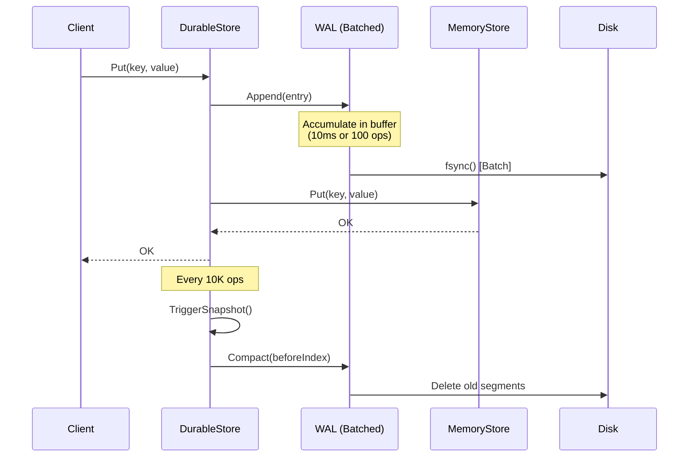

#### Snapshot System

Snapshots provide bounded recovery time and enable WAL compaction.

**Snapshot Encoding Formats:**

RaftKV uses **two distinct snapshot systems** with different encoding formats:

1. **DurableStore Snapshots** (GOB encoding)
   - Used for single-node persistence and crash recovery
   - Faster, Go-native binary serialization
   - File location: `<data_dir>/snapshots/snapshot-*.gob`
   - Created by `DurableStore.TriggerSnapshot()`

2. **Raft FSM Snapshots** (JSON encoding)
   - Used for Raft cluster replication and new node bootstrap
   - Portable across nodes, human-readable
   - Managed by hashicorp/raft library
   - Created during Raft log compaction

**DurableStore Snapshot Structure (GOB):**

```go
type Snapshot struct {
    RaftIndex uint64            // Raft log index at snapshot time
    RaftTerm  uint64            // Raft term at snapshot time
    Index     uint64            // WAL index at snapshot time
    Timestamp time.Time         // Snapshot creation time
    KeyCount  int64             // Number of keys
    Data      map[string][]byte // All key-value pairs
}
```

**Snapshot Strategy:**

- **Trigger**: Every 10,000 operations (configurable via `storage.snapshot_every`)
- **Format**: GOB-encoded Go structs (fast, native)
- **Retention**: Keep last 3 snapshots (configurable)
- **Compaction**: Delete WAL segments before `(RaftIndex - 100)`
- **Atomic Creation**: Write to temp file, then atomic rename

**Recovery Flow:**

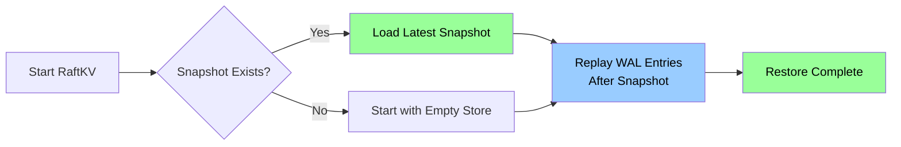

#### LRU Cache

The LRU (Least Recently Used) cache accelerates read-heavy workloads.

**Features:**

- **Size**: 10,000 entries default (configurable via `cache.max_size`)
- **TTL**: Optional time-to-live (default: no expiration)
- **Hit Rate**: ~90% for read-heavy workloads
- **Performance**: **5x faster reads** for cached keys
- **Metrics**: Hit rate, misses, evictions exposed via Prometheus

**Cache Flow:**

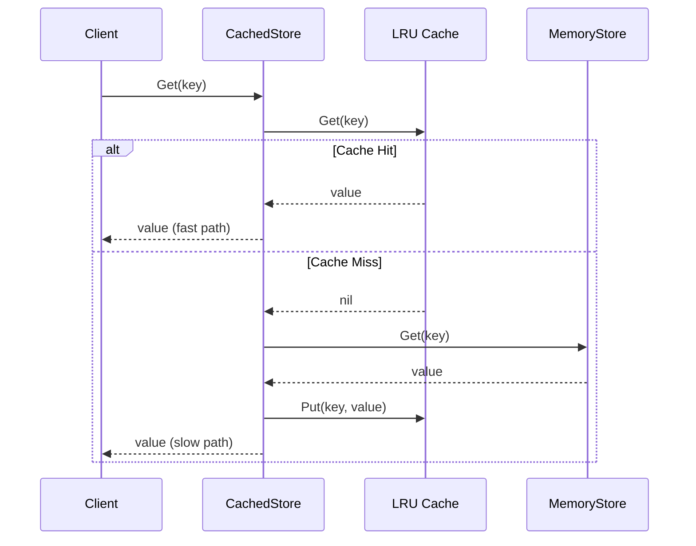

#### Storage Metrics

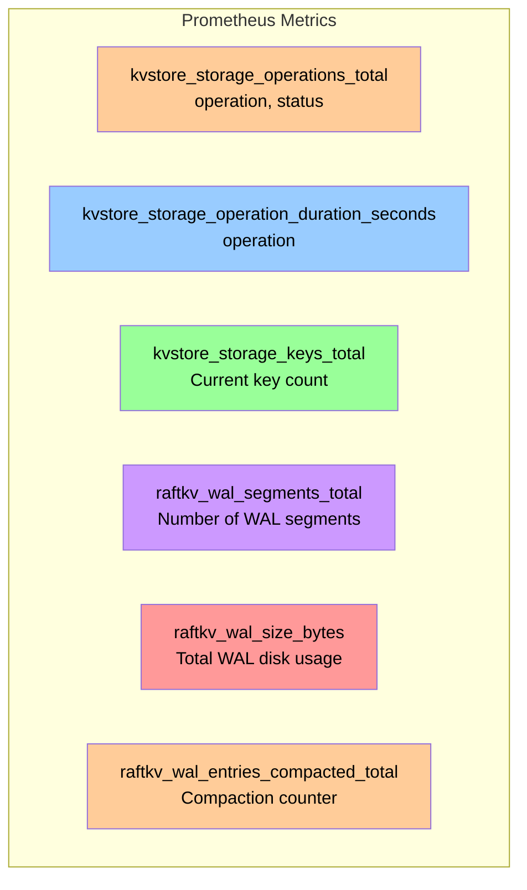

---

### Raft Consensus Layer

RaftKV uses the Raft consensus algorithm for distributed coordination, ensuring strong consistency and fault tolerance.

#### Raft Architecture

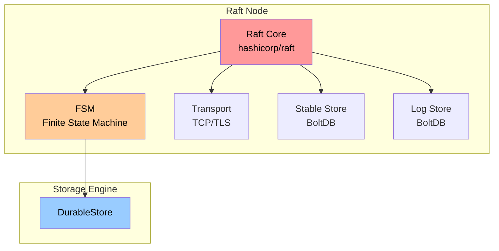

#### Finite State Machine (FSM)

The FSM bridges Raft consensus and the storage engine.

**Key Operations:**

```go
type FSM struct {
    store  *storage.DurableStore
    logger *zap.Logger
}

// Apply applies a Raft log entry to the storage engine
func (f *FSM) Apply(log *raft.Log) interface{} {
    var cmd RaftCommand
    json.Unmarshal(log.Data, &cmd)

    switch cmd.Operation {
    case "put":
        return f.store.ApplyRaftEntry(log.Index, log.Term,
                                      cmd.Key, cmd.Value)
    case "delete":
        return f.store.Delete(context.Background(), cmd.Key)
    }
}

// Snapshot creates a point-in-time snapshot
func (f *FSM) Snapshot() (raft.FSMSnapshot, error) {
    // Delegate to DurableStore's snapshot manager
}

// Restore restores state from a snapshot
func (f *FSM) Restore(rc io.ReadCloser) error {
    // Restore from Raft snapshot
}
```

**Raft Command Format:**

```json
{
  "op": "put" | "delete",
  "key": "user:123",
  "value": [binary data]
}
```

**Go Struct:**

```go
type Command struct {
    Op    string `json:"op"`    // "put" or "delete"
    Key   string `json:"key"`
    Value []byte `json:"value"`
}
```

#### Cluster Formation

**Bootstrap (First Node):**

```yaml
raft:
  enabled: true
  node_id: "node1"
  raft_addr: "localhost:7000"
  bootstrap: true  # Bootstrap the cluster
```

**Join Cluster (Additional Nodes):**

```yaml
raft:
  enabled: true
  node_id: "node2"
  raft_addr: "localhost:7001"
  join_addr: "http://node1:8080/cluster/join"  # Join existing cluster
```

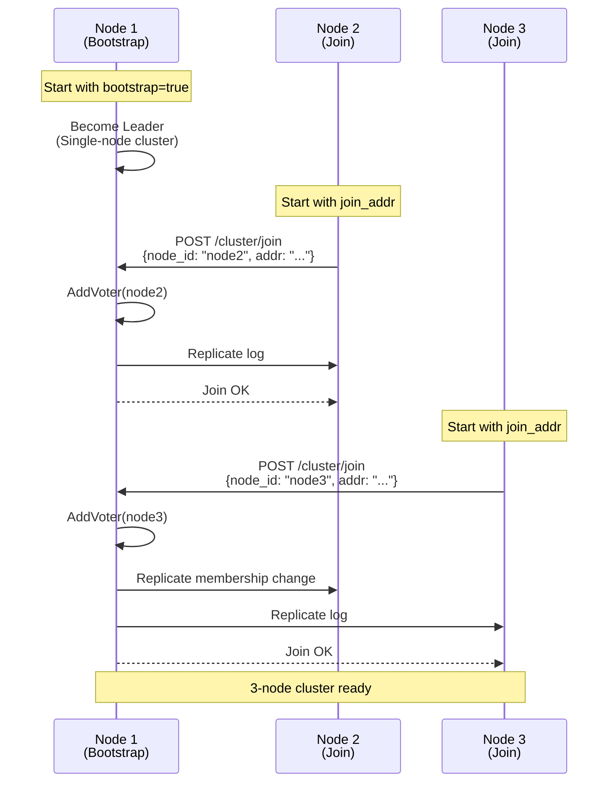

#### Raft Configuration

| Parameter            | Default | Description               |
| -------------------- | ------- | ------------------------- |
| `HeartbeatTimeout`   | 1000ms  | Leader heartbeat interval |
| `ElectionTimeout`    | 1000ms  | Follower election trigger |
| `LeaderLeaseTimeout` | 500ms   | Leadership confirmation   |
| `CommitTimeout`      | 50ms    | Commit acknowledgment     |
| `SnapshotThreshold`  | 8192    | Entries before snapshot   |

---

## Data Flow

### Write Operation (Cluster Mode)

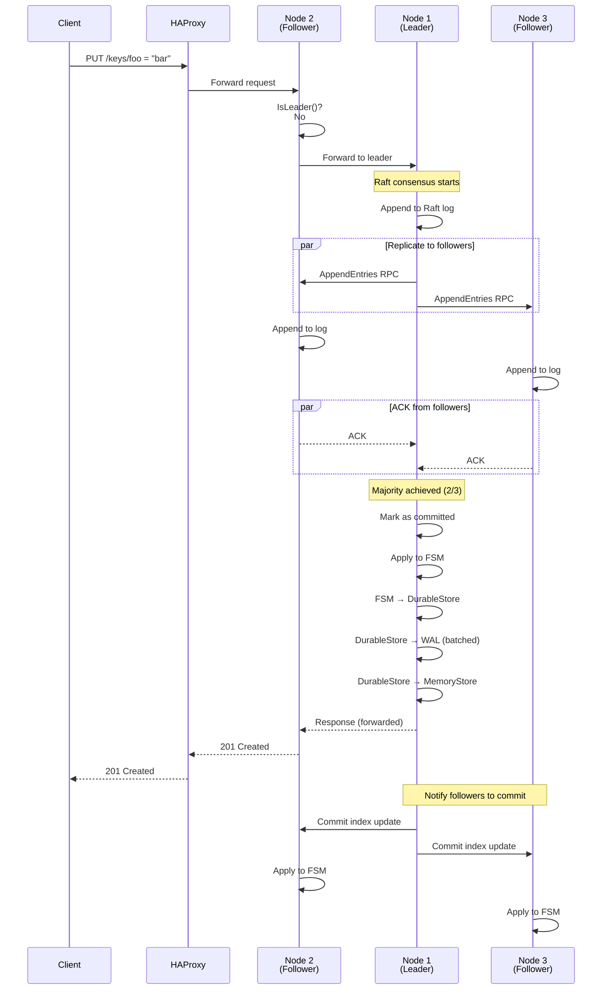

**Key Steps:**

1. **Request Routing**: Client → HAProxy → Random node
2. **Leader Forwarding**: Non-leader forwards to leader
3. **Raft Consensus**: Leader appends to log, replicates to followers
4. **Majority Quorum**: Leader waits for majority ACKs (2/3)
5. **Commit & Apply**: Leader marks as committed, applies to FSM
6. **FSM Application**: FSM → DurableStore → WAL + MemoryStore
7. **Response**: Leader responds to client
8. **Follower Commit**: Leader notifies followers to apply

### Read Operation (Stale Reads)

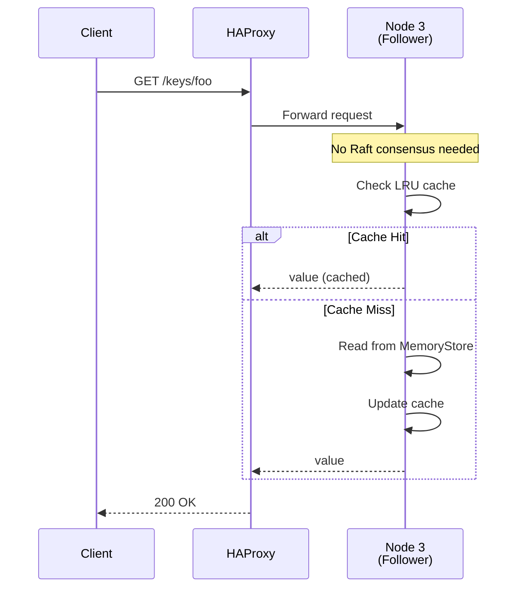

**Stale Reads vs. Linearizable Reads:**

| Feature         | Stale Reads                              | Linearizable Reads                         |
| --------------- | ---------------------------------------- | ------------------------------------------ |
| **Consistency** | Eventually consistent                    | Strongly consistent                        |
| **Latency**     | Low (<10ms)                              | Higher (~30ms)                             |
| **Read from**   | Any node                                 | Leader only                                |
| **Use Case**    | High-throughput, eventual consistency OK | Critical data, strong consistency required |

### Leader Failover

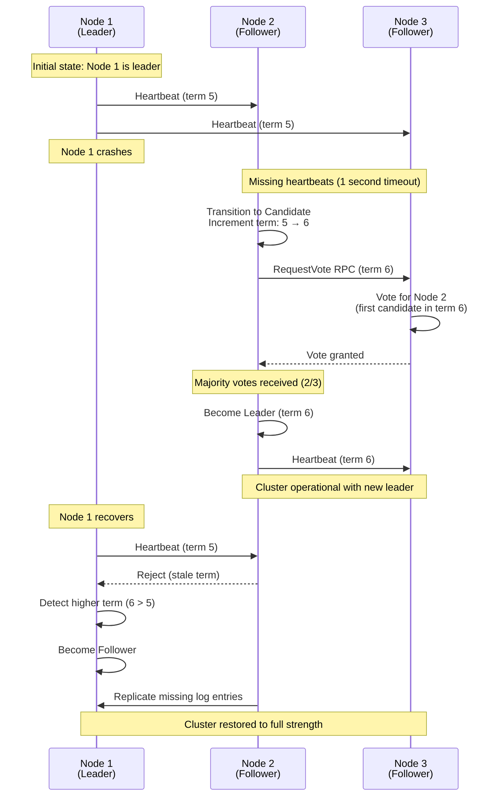

**Failover Guarantees:**

- **Election Time**: <1 second (configurable via `election_timeout`)
- **Data Loss**: None (committed entries never lost if majority alive)
- **Availability**: Cluster operational if majority nodes available
  - 3-node cluster: Tolerates 1 failure
  - 5-node cluster: Tolerates 2 failures

---

## Deployment

### Single-Node Deployment

**Use Case:** Development, testing, small-scale production

```bash
# 1. Build
make build

# 2. Run
./bin/kvstore --config=config/config.dev.yaml

# 3. Test
curl http://localhost:8080/health
```

**Configuration:**

```yaml
raft:
  enabled: false  # Single-node mode

storage:
  data_dir: "./data"
  sync_on_write: true
  snapshot_every: 10000

server:
  http_addr: ":8080"
```

**Features:**

- No Raft overhead (faster writes)
- Simple setup (single binary)
- Data persisted via WAL + snapshots
- Not fault-tolerant (single point of failure)

### 3-Node Raft Cluster

**Use Case:** Production, high availability

#### Architecture

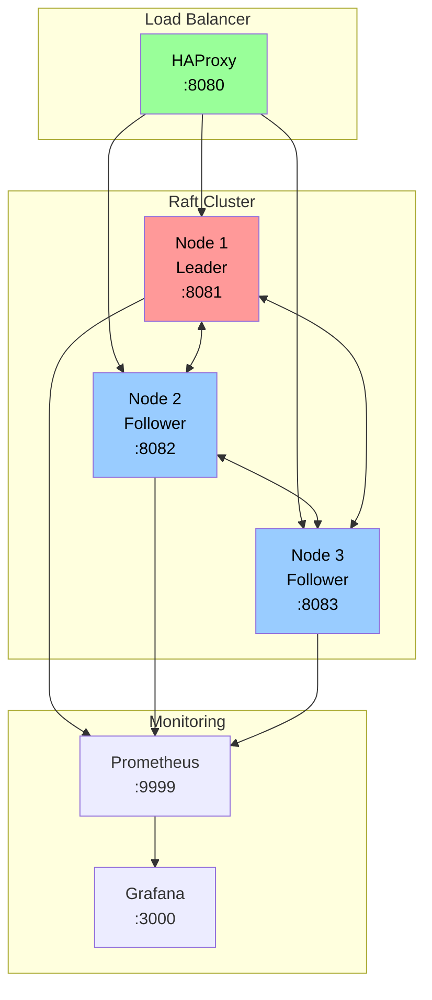

#### Docker Compose Deployment

```bash
# Start 3-node cluster with HAProxy
make docker-up-lb

# Check cluster status
curl http://localhost:8080/cluster/nodes

# View logs
make docker-logs

# Stop cluster
make docker-down
```

**Docker Compose Services:**

```yaml
services:
  node1:
    image: raftkv:latest
    environment:
      - RAFTKV_RAFT__ENABLED=true
      - RAFTKV_RAFT__NODE_ID=node1
      - RAFTKV_RAFT__BOOTSTRAP=true
    ports:
      - "8081:8080"

  node2:
    image: raftkv:latest
    environment:
      - RAFTKV_RAFT__ENABLED=true
      - RAFTKV_RAFT__NODE_ID=node2
      - RAFTKV_RAFT__JOIN_ADDR=http://node1:8080/cluster/join
    ports:
      - "8082:8080"

  node3:
    image: raftkv:latest
    environment:
      - RAFTKV_RAFT__ENABLED=true
      - RAFTKV_RAFT__NODE_ID=node3
      - RAFTKV_RAFT__JOIN_ADDR=http://node1:8080/cluster/join
    ports:
      - "8083:8080"

  haproxy:
    image: haproxy:2.9
    ports:
      - "8080:8080"
    volumes:
      - ./haproxy.cfg:/usr/local/etc/haproxy/haproxy.cfg
```

#### Manual Cluster Setup

**Node 1 (Bootstrap):**

```bash
./bin/kvstore --config=config/node1.yaml
```

```yaml
# config/node1.yaml
raft:
  enabled: true
  node_id: "node1"
  raft_addr: "localhost:7000"
  bootstrap: true

server:
  http_addr: ":8081"
```

**Node 2 (Join):**

```bash
./bin/kvstore --config=config/node2.yaml
```

```yaml
# config/node2.yaml
raft:
  enabled: true
  node_id: "node2"
  raft_addr: "localhost:7001"
  join_addr: "http://localhost:8081/cluster/join"

server:
  http_addr: ":8082"
```

**Node 3 (Join):**

```bash
./bin/kvstore --config=config/node3.yaml
```

```yaml
# config/node3.yaml
raft:
  enabled: true
  node_id: "node3"
  raft_addr: "localhost:7002"
  join_addr: "http://localhost:8081/cluster/join"

server:
  http_addr: ":8083"
```

### Monitoring Stack

```bash
# Start cluster with Prometheus + Grafana
make docker-up-monitoring

# Access Grafana
open http://localhost:3000  # admin/admin

# Access Prometheus
open http://localhost:9999
```

**Pre-built Grafana Dashboards:**

1. **Overview Dashboard**: Ops/sec, latency percentiles, error rate
2. **Storage & Persistence Dashboard**: WAL, snapshots, cache metrics
3. **Cluster Health Dashboard**: Raft metrics, leader elections, node status

---

## Performance

### Single-Node Performance

**Hardware:** Apple M1, 16GB RAM

| Operation             | Throughput    | Latency (P99) |
| --------------------- | ------------- | ------------- |
| **Read (cached)**     | ~500K ops/sec | <1ms          |
| **Read (uncached)**   | ~200K ops/sec | <5ms          |
| **Write (batched)**   | ~200K ops/sec | <20ms         |
| **Write (unbatched)** | ~20K ops/sec  | <50ms         |

### Cluster Performance

**Hardware:** 3 nodes, Docker Compose, Apple M1

| Operation               | Throughput    | Latency (P99) |
| ----------------------- | ------------- | ------------- |
| **Write (leader)**      | ~50K ops/sec  | <30ms         |
| **Read (follower)**     | ~200K ops/sec | <10ms         |
| **Read (linearizable)** | ~50K ops/sec  | <30ms         |

### Optimization Features

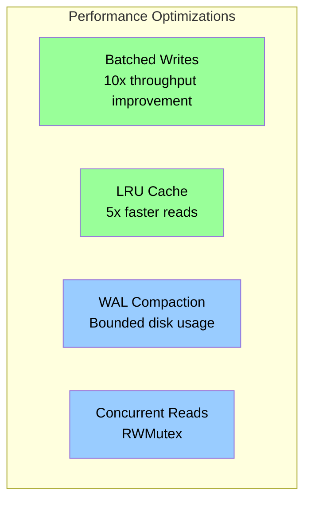

**Batched Writes:**

- **Implementation**: `BatchedWAL` wrapper class around base `WAL`
- Accumulate writes for 10ms or 100 operations (whichever comes first)
- Single `fsync()` per batch (instead of per-operation)
- **10x throughput improvement**: 20K → 200K ops/sec
- Configuration: `wal.batch_enabled`, `wal.batch_size`, `wal.batch_wait_time`
- File: [internal/storage/wal_batch.go](internal/storage/wal_batch.go:1)

**LRU Cache:**

- **Implementation**: `CachedStore` wrapper around `DurableStore`
- Cache read operations (default: 10K entries)
- ~90% hit rate for read-heavy workloads
- **5x faster reads** for cached keys
- Configuration: `cache.enabled`, `cache.max_size`, `cache.ttl`
- Files: [internal/storage/cache.go](internal/storage/cache.go:1), [internal/storage/cached_store.go](internal/storage/cached_store.go:1)

**WAL Compaction:**

- Automatic cleanup after snapshots
- Safety margin: Keep 100 entries before snapshot
- Bounded disk usage (no unbounded growth)
- Metrics: `raftkv_wal_segments_total`, `raftkv_wal_size_bytes`

---

## Security

### Authentication & Authorization

RaftKV supports multiple authentication methods and role-based access control (RBAC).

#### Authentication Methods

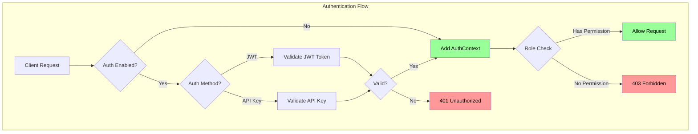

**1. JWT (JSON Web Tokens):**

```bash
# Login
curl -X POST http://localhost:8080/auth/login \
  -H "Content-Type: application/json" \
  -d '{"username": "admin", "password": "admin"}'

# Response
{
  "token": "eyJhbGciOiJIUzI1NiIsInR5cCI6IkpXVCJ9...",
  "expires_at": "2025-11-09T12:00:00Z"
}

# Use token
curl http://localhost:8080/keys/foo \
  -H "Authorization: Bearer eyJhbGci..."
```

**2. API Keys:**

```bash
# Create API key
curl -X POST http://localhost:8080/auth/apikeys \
  -H "Authorization: Bearer $TOKEN" \
  -H "Content-Type: application/json" \
  -d '{"name": "my-app-key", "role": "write"}'

# Response
{
  "key": "ak_1234567890abcdef",
  "name": "my-app-key",
  "role": "write"
}

# Use API key
curl http://localhost:8080/keys/foo \
  -H "X-API-Key: ak_1234567890abcdef"
```

#### RBAC Roles

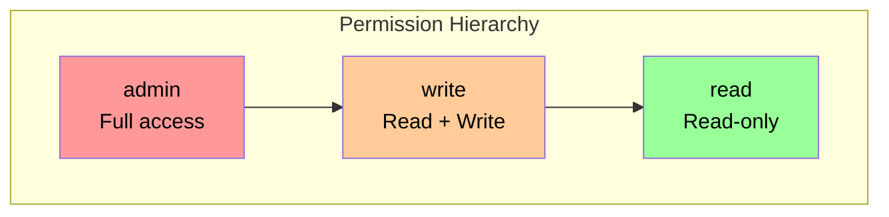

**Permission Matrix:**

| Endpoint               | read | write | admin |
| ---------------------- | ---- | ----- | ----- |
| `GET /keys/{key}`      | ✅    | ✅     | ✅     |
| `PUT /keys/{key}`      | ❌    | ✅     | ✅     |
| `DELETE /keys/{key}`   | ❌    | ✅     | ✅     |
| `GET /keys?prefix=`    | ✅    | ✅     | ✅     |
| `POST /admin/snapshot` | ❌    | ❌     | ✅     |
| `POST /cluster/join`   | ❌    | ❌     | ✅     |
| `POST /cluster/remove` | ❌    | ❌     | ✅     |

**Default Admin User:**

On first startup, RaftKV automatically creates:

- **Username**: `admin`
- **Password**: `admin`
- **Role**: `admin`

**⚠️ IMPORTANT**: Change the default password immediately in production!

```bash
# Change admin password
curl -X PUT http://localhost:8080/auth/users/admin/password \
  -H "Authorization: Bearer $TOKEN" \
  -H "Content-Type: application/json" \
  -d '{"new_password": "secure-password-here"}'
```

### TLS/mTLS Encryption

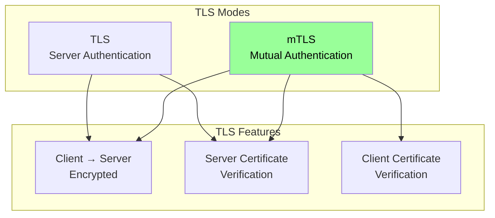

**TLS Configuration:**

```yaml
tls:
  enabled: true
  cert_file: "certs/server-cert.pem"
  key_file: "certs/server-key.pem"
  ca_file: "certs/ca-cert.pem"       # For mTLS
  enable_mtls: false                  # Set to true for mTLS
```

**Generate Certificates:**

```bash
# Generate CA + server + client certificates
make tls-certs

# Creates:
# - certs/ca-cert.pem (CA certificate)
# - certs/ca-key.pem (CA private key)
# - certs/server-cert.pem (Server certificate)
# - certs/server-key.pem (Server private key)
# - certs/client-cert.pem (Client certificate)
# - certs/client-key.pem (Client private key)
```

**Client Usage (TLS):**

```bash
# HTTP client with TLS
curl https://localhost:8080/health --cacert certs/ca-cert.pem

# CLI client with TLS
kvcli --tls --ca-cert=certs/ca-cert.pem get foo
```

**Client Usage (mTLS):**

```bash
# HTTP client with mTLS
curl https://localhost:8080/health \
  --cacert certs/ca-cert.pem \
  --cert certs/client-cert.pem \
  --key certs/client-key.pem

# CLI client with mTLS
kvcli --tls --mtls \
  --ca-cert=certs/ca-cert.pem \
  --cert=certs/client-cert.pem \
  --key=certs/client-key.pem \
  get foo
```

### Security Best Practices

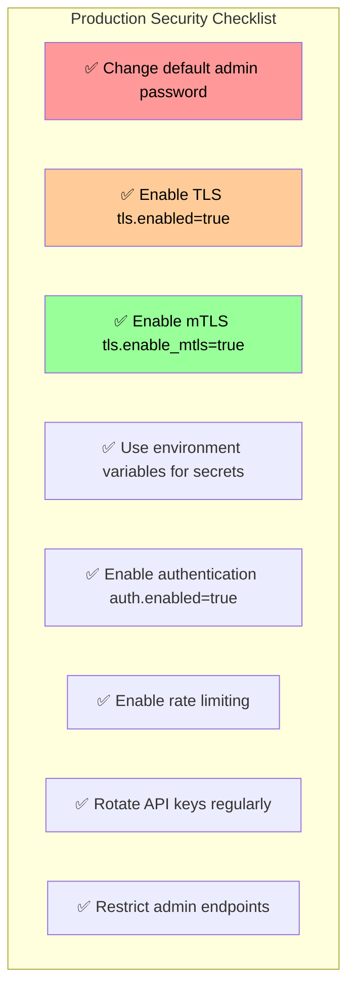

1. **Change default admin password immediately**
2. **Use environment variables for JWT secret**
   ```bash
   export RAFTKV_AUTH__JWT_SECRET="random-256-bit-secret"
   ```
3. **Enable TLS in production** (`tls.enabled: true`)
4. **Enable mTLS for inter-node communication** (`tls.enable_mtls: true`)
5. **Rotate API keys regularly** (90-day policy)
6. **Enable authentication** (`auth.enabled: true`)
7. **Use rate limiting** (`performance.enable_rate_limit: true`)
8. **Restrict admin endpoints** (firewall or network policy)

---

## Monitoring

### Prometheus Metrics

RaftKV exposes **15+ Prometheus metrics** at `/metrics` endpoint.

#### HTTP Metrics

```promql
# Request rate
rate(kvstore_http_requests_total[5m])

# Latency percentiles
histogram_quantile(0.99, kvstore_http_request_duration_seconds_bucket)

# Error rate
rate(kvstore_http_requests_total{status="5xx"}[5m])
```

#### Storage Metrics

```promql
# Operations per second
rate(kvstore_storage_operations_total[5m])

# Current key count
kvstore_storage_keys_total

# WAL disk usage
raftkv_wal_size_bytes / 1024 / 1024  # Convert to MB
```

#### Raft Metrics

```promql
# Raft log size
raftkv_raft_log_size_bytes / 1024 / 1024  # Convert to MB

# Log entries
raftkv_raft_log_entries_total
```

### Grafana Dashboards

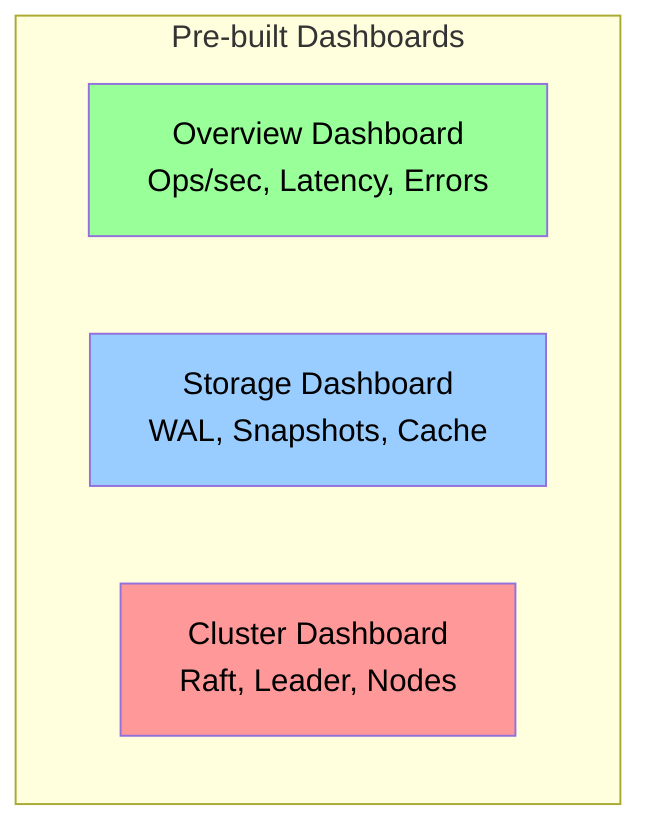

**Dashboard URLs:**

- **Overview**: `http://localhost:3000/d/raftkv-overview`
- **Storage**: `http://localhost:3000/d/raftkv-storage`
- **Cluster**: `http://localhost:3000/d/raftkv-cluster`

**Dashboard Panels:**

1. **Overview Dashboard**:
   - Operations per second (ops/sec)
   - Latency percentiles (P50, P95, P99)
   - Error rate (5xx errors)
   - Key count over time
   - Request rate by endpoint

2. **Storage & Persistence Dashboard**:
   - WAL segments count
   - WAL disk usage (MB)
   - Snapshot creation rate
   - Cache hit rate
   - Compaction metrics

3. **Cluster Health Dashboard**:
   - Raft log replication lag
   - Leader elections
   - Node status (leader/follower)
   - Cluster membership

### Structured Logging

```json
{
  "level": "info",
  "ts": 1699564800.123,
  "msg": "Applied Raft entry",
  "op": "put",
  "key": "user:123",
  "index": 42,
  "term": 5,
  "node_id": "node1",
  "is_leader": true
}
```

**Log Levels:**

- **debug**: Internal state changes, cache hits/misses
- **info**: Operations, cluster events, leader elections
- **warn**: Recoverable errors, compaction warnings
- **error**: Serious errors, failed operations

**Configuration:**

```yaml
observability:
  log_level: "info"        # debug, info, warn, error
  log_format: "json"       # json, console
  metrics_enabled: true
```

---

## Operations

### Cluster Management

#### Check Cluster Status

```bash
# List all nodes
curl http://localhost:8080/cluster/nodes

# Response
{
  "nodes": [
    {"id": "node1", "addr": "node1:7000", "role": "leader"},
    {"id": "node2", "addr": "node2:7000", "role": "follower"},
    {"id": "node3", "addr": "node3:7000", "role": "follower"}
  ]
}

# Get leader
curl http://localhost:8080/cluster/leader

# Response
{
  "id": "node1",
  "addr": "node1:7000",
  "http_addr": "http://node1:8080"
}
```

#### Add Node

```bash
# Start new node
./bin/kvstore --config=config/node4.yaml

# Node automatically joins via join_addr
```

```yaml
# config/node4.yaml
raft:
  enabled: true
  node_id: "node4"
  raft_addr: "localhost:7003"
  join_addr: "http://localhost:8081/cluster/join"
```

#### Remove Node

```bash
# Via API (requires admin role)
curl -X POST http://localhost:8080/cluster/remove \
  -H "Authorization: Bearer $TOKEN" \
  -H "Content-Type: application/json" \
  -d '{"node_id": "node4"}'

# Via CLI
kvcli cluster remove node4
```

### Backup & Recovery

#### Manual Snapshot

```bash
# Trigger snapshot (requires admin role)
curl -X POST http://localhost:8080/admin/snapshot \
  -H "Authorization: Bearer $TOKEN"

# Response
{
  "index": 10523,
  "raft_index": 10523,
  "raft_term": 5,
  "key_count": 1000,
  "file": "snapshot-10523.gob"
}
```

#### Restore from Snapshot

```bash
# 1. Stop RaftKV
systemctl stop raftkv

# 2. Copy snapshot to data directory
cp backup/snapshot-10523.gob /var/lib/raftkv/snapshots/

# 3. Delete WAL segments
rm /var/lib/raftkv/*.wal

# 4. Start RaftKV (auto-restores from snapshot)
systemctl start raftkv
```

#### Automatic Snapshots

```yaml
storage:
  snapshot_every: 10000  # Snapshot every 10K operations
```

### Monitoring Alerts

#### Critical Alerts

```yaml
# Prometheus alerting rules
groups:
  - name: raftkv_critical
    rules:
      - alert: RaftNoLeader
        expr: absent(raftkv_raft_is_leader == 1)
        for: 1m
        annotations:
          summary: "No Raft leader for >1 minute"

      - alert: DiskSpaceCritical
        expr: raftkv_wal_size_bytes > 10737418240  # 10GB
        for: 5m
        annotations:
          summary: "WAL disk usage >10GB"

      - alert: HighErrorRate
        expr: rate(kvstore_http_requests_total{status="5xx"}[5m]) > 0.05
        for: 5m
        annotations:
          summary: "5xx error rate >5%"
```

#### Warning Alerts

```yaml
groups:
  - name: raftkv_warning
    rules:
      - alert: HighWriteLatency
        expr: histogram_quantile(0.99, kvstore_storage_operation_duration_seconds_bucket{operation="put"}) > 0.1
        for: 5m
        annotations:
          summary: "P99 write latency >100ms"

      - alert: LowCacheHitRate
        expr: rate(kvstore_storage_operations_total{operation="get", status="cache_hit"}[5m]) / rate(kvstore_storage_operations_total{operation="get"}[5m]) < 0.2
        for: 10m
        annotations:
          summary: "Cache hit rate <20%"
```

### Troubleshooting

#### Leader Not Elected

**Symptom:** Cluster unavailable, writes fail

**Diagnosis:**

```bash
# Check node status
curl http://localhost:8080/cluster/nodes

# Check logs
docker-compose logs node1 | grep "leader"
```

**Solution:**

1. Check Raft timeouts (`raft.election_timeout`)
2. Ensure majority nodes are alive (2/3 for 3-node cluster)
3. Check network connectivity between nodes
4. Check Raft logs for errors

#### High WAL Disk Usage

**Symptom:** Disk usage growing unbounded

**Diagnosis:**

```promql
raftkv_wal_size_bytes / 1024 / 1024  # Convert to MB
```

**Solution:**

1. Enable WAL compaction (`wal.compaction_enabled: true`)
2. Trigger manual snapshot (`POST /admin/snapshot`)
3. Reduce snapshot interval (`storage.snapshot_every: 5000`)
4. Check snapshot creation logs

#### Slow Writes

**Symptom:** P99 write latency >100ms

**Diagnosis:**

```promql
histogram_quantile(0.99, kvstore_storage_operation_duration_seconds_bucket{operation="put"})
```

**Solution:**

1. Enable batched writes (`wal.batch_enabled: true`)
2. Increase batch size (`wal.batch_size: 1000`)
3. Check disk I/O (`iostat -x 1`)
4. Increase `wal.batch_wait_time` (trade latency for throughput)

#### Low Cache Hit Rate

**Symptom:** Cache hit rate <20%

**Diagnosis:**

```promql
rate(kvstore_storage_operations_total{operation="get", status="cache_hit"}[5m]) / rate(kvstore_storage_operations_total{operation="get"}[5m])
```

**Solution:**

1. Increase cache size (`cache.max_size: 100000`)
2. Enable TTL (`cache.ttl: 1h`)
3. Check access patterns (are keys random or hot?)
4. Monitor cache evictions

---

## Technology Stack

| Component         | Technology             | Version | Purpose                    |
| ----------------- | ---------------------- | ------- | -------------------------- |
| **Language**      | Go                     | 1.25+   | Core implementation        |
| **Consensus**     | HashiCorp Raft         | 1.7.3   | Distributed consensus      |
| **HTTP Router**   | Gorilla Mux            | 1.8.1   | REST API routing           |
| **gRPC**          | google.golang.org/grpc | 1.76.0  | Binary RPC protocol        |
| **Serialization** | Protocol Buffers       | 1.36.8  | gRPC message encoding      |
| **Logging**       | Uber Zap               | 1.27.0  | Structured logging         |
| **Metrics**       | Prometheus Client      | 1.23.2  | Metrics collection         |
| **Auth**          | golang-jwt             | 5.3.0   | JWT token handling         |
| **Config**        | Koanf                  | 2.3.0   | Multi-source configuration |
| **Crypto**        | golang.org/x/crypto    | 0.43.0  | Password hashing           |
| **Testing**       | testify                | 1.11.1  | Test assertions            |

---

## Key Architectural Decisions

### Why HashiCorp Raft?

- **Battle-tested**: Used in Consul, Vault, Nomad (production-proven)
- **Clean interface**: FSM abstraction simplifies integration
- **Well-documented**: Extensive documentation and examples
- **Active maintenance**: Regular updates and bug fixes
- **TLS support**: Built-in security features

### Why GOB for DurableStore Snapshots?

RaftKV uses **two snapshot formats** for different purposes:

**1. GOB (DurableStore snapshots):**
- **Native Go encoding**: No external dependencies
- **Fast serialization**: Optimized for Go types
- **Type-safe**: Compile-time type checking
- **Easy to version**: Add fields without breaking changes
- **Use case**: Single-node persistence and crash recovery

**2. JSON (Raft FSM snapshots):**
- **Portable**: Works across different Raft nodes
- **Human-readable**: Easy to debug and inspect
- **Standard format**: Required by hashicorp/raft library
- **Use case**: Cluster replication and new node bootstrap

**Alternative considered:** Protocol Buffers (more complex, overkill for snapshots)

### Why Batched WAL?

**Problem:** `fsync()` is slow (~5ms per call)

**Solution:** Accumulate writes for 10ms, single `fsync()` per batch

**Result:** **10x throughput improvement** (20K → 200K ops/sec)

**Trade-off:** Slight increase in write latency (10ms)

### Why LRU Cache?

**Problem:** Disk I/O bottleneck for read-heavy workloads

**Solution:** In-memory cache for hot keys (10K entries)

**Result:** **5x faster reads** for cached keys

**Trade-off:** Memory overhead (~100MB for 10K entries)

---

## Future Roadmap

### v1.0 (Current Focus)

- [x] Core KV storage with Raft consensus
- [x] TLS/mTLS security
- [x] Authentication and RBAC
- [x] Performance optimizations (batching, caching, compaction)
- [x] Monitoring infrastructure (Prometheus + Grafana)
- [x] Configuration management (multi-source)
- [x] Complete documentation

### v1.1 (Future)

- [ ] Kubernetes operator (StatefulSet, PVCs)
- [ ] Backup/restore automation (S3 integration)
- [ ] Multi-datacenter replication (cross-region)
- [ ] Encryption at rest (AES-256)
- [ ] Support for KVP Protocal

### v2.0 (Long-term)

- [ ] Horizontal sharding (consistent hashing)
- [ ] Secondary indexes (B-tree, hash)
- [ ] Transactions (multi-key ACID)
- [ ] Time-series optimizations (LSM tree)

---

## Quick Start

### Single-Node Mode

```bash
# 1. Build
make build

# 2. Run
./bin/kvstore

# 3. Test
curl http://localhost:8080/health

# 4. Write data
curl -X PUT http://localhost:8080/keys/foo -d "bar"

# 5. Read data
curl http://localhost:8080/keys/foo
```

### Cluster Mode (Docker)

```bash
# 1. Start 3-node cluster
make docker-up-lb

# 2. Check cluster status
curl http://localhost:8080/cluster/nodes

# 3. Write to leader
curl -X PUT http://localhost:8080/keys/test -d "hello"

# 4. Read from follower (stale read)
curl http://localhost:8082/keys/test

# 5. View logs
make docker-logs
```

### With Monitoring

```bash
# 1. Start cluster + monitoring
make docker-up-monitoring

# 2. Access Grafana
open http://localhost:3000  # admin/admin

# 3. Access Prometheus
open http://localhost:9999

# 4. View dashboards
# - Overview: http://localhost:3000/d/raftkv-overview
# - Storage: http://localhost:3000/d/raftkv-storage
# - Cluster: http://localhost:3000/d/raftkv-cluster
```

---

## References

**Documentation:**

- [README.md](README.md) - Quick start and feature overview
- [AUTHENTICATION_GUIDE.md](AUTHENTICATION_GUIDE.md) - Authentication setup
- [TLS_IMPLEMENTATION_SUMMARY.md](TLS_IMPLEMENTATION_SUMMARY.md) - TLS/mTLS details
- [config/README.md](config/README.md) - Configuration documentation
- [deployments/docker/MONITORING.md](deployments/docker/MONITORING.md) - Monitoring setup

**Key Source Files:**

- [cmd/kvstore/main.go](cmd/kvstore/main.go:1) (349 lines) - Entry point
- [internal/storage/durable_store.go](internal/storage/durable_store.go:1) (506 lines) - Storage coordinator
- [internal/consensus/raft.go](internal/consensus/raft.go:1) (461 lines) - Raft wrapper
- [internal/server/http.go](internal/server/http.go:1) (416 lines) - HTTP API
- [internal/config/config.go](internal/config/config.go:1) (387 lines) - Configuration

**External Resources:**

- [Raft Paper](https://raft.github.io/raft.pdf) - Original Raft consensus algorithm
- [HashiCorp Raft](https://github.com/hashicorp/raft) - Raft library used
- [Prometheus](https://prometheus.io/docs/) - Metrics collection
- [Grafana](https://grafana.com/docs/) - Dashboards

---

## Contributing

**Repository:** https://github.com/RashikAnsar/raftkv

**Issues:** Open an issue on GitHub

**Contributing:**

1. Fork the repository
2. Create feature branch (`git checkout -b feature/amazing-feature`)
3. Write tests (`make test`)
4. Commit changes (`git commit -m 'Add amazing feature'`)
5. Push to branch (`git push origin feature/amazing-feature`)
6. Submit pull request

**Code Style:**

- Follow Go conventions (`gofmt`, `golint`)
- Add tests for new features (>80% coverage)
- Update documentation
- Sign commits (GPG)

