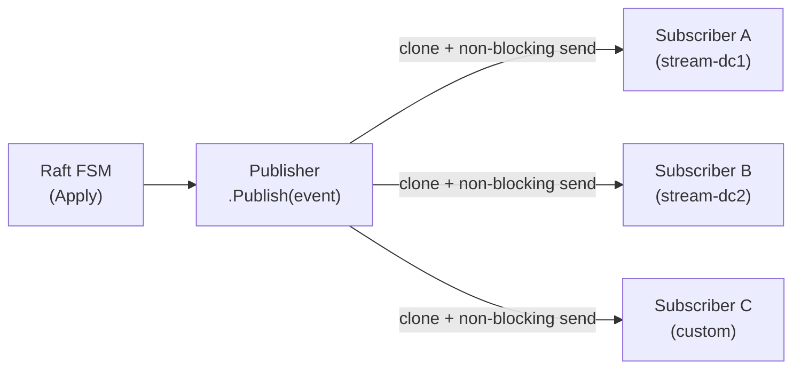
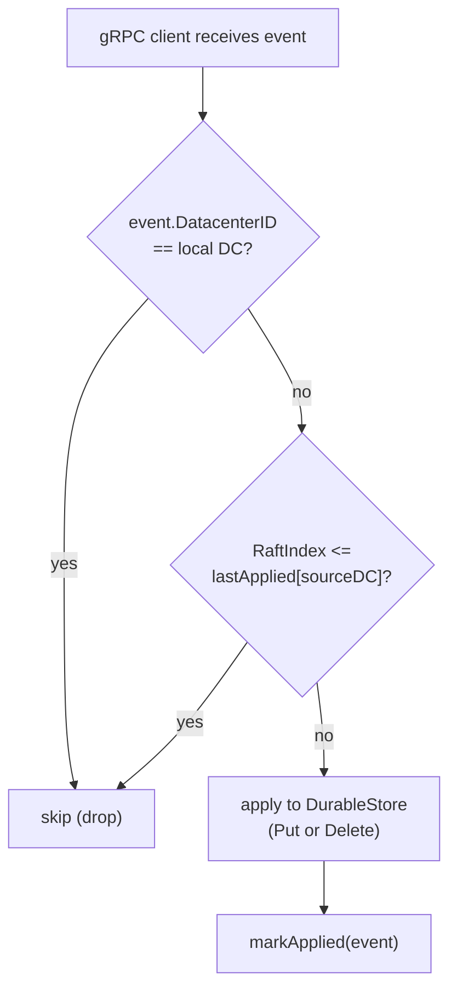
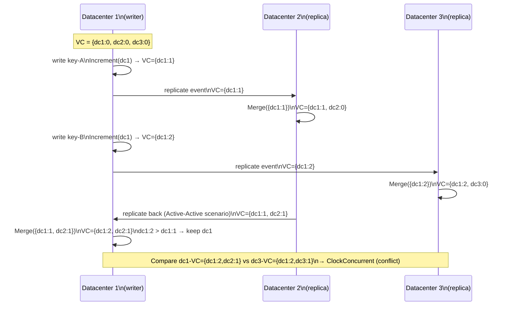
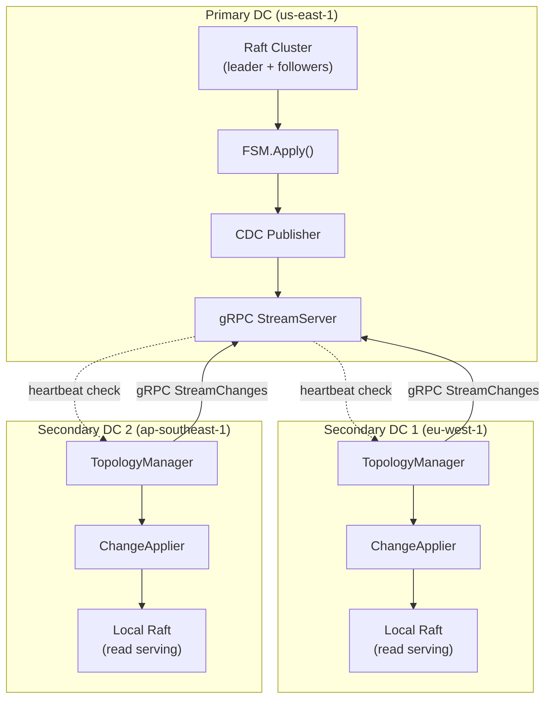
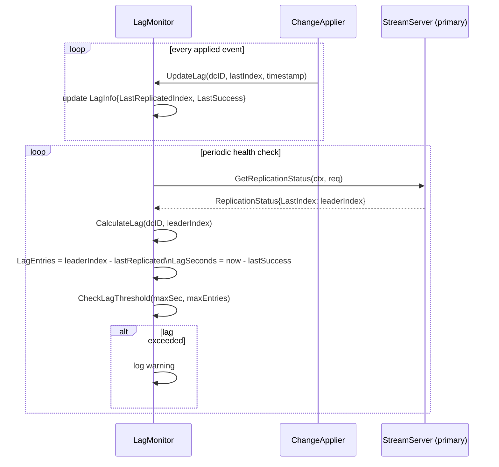
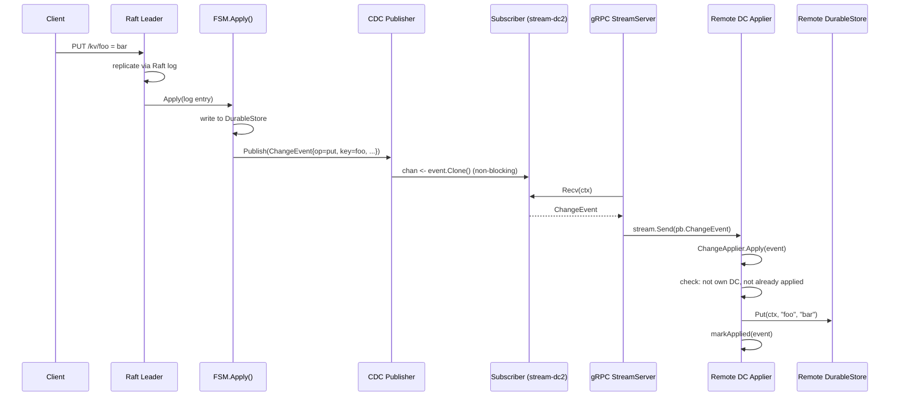

# CDC and Cross-DC Replication

> Change Data Capture (CDC) pipeline and cross-datacenter replication for RaftKV. Covers the event model, publisher-subscriber bus, gRPC streaming, remote applier, vector clocks, topology management, and lag monitoring.

## Table of Contents

- [CDC and Cross-DC Replication](#cdc-and-cross-dc-replication)
  - [Table of Contents](#table-of-contents)
  - [Overview](#overview)
  - [Current Implementation Status](#current-implementation-status)
  - [CDC Subsystem](#cdc-subsystem)
    - [ChangeEvent Model](#changeevent-model)
    - [Publisher](#publisher)
    - [Subscriber](#subscriber)
    - [Event Filters](#event-filters)
  - [Cross-DC Replication](#cross-dc-replication)
    - [StreamServer (gRPC)](#streamserver-grpc)
    - [ChangeApplier](#changeapplier)
    - [Conflict Resolution](#conflict-resolution)
  - [Vector Clocks](#vector-clocks)
    - [Clock Operations](#clock-operations)
    - [Causality Relationships](#causality-relationships)
    - [Vector Clock Update Sequence](#vector-clock-update-sequence)
  - [Topology Management](#topology-management)
    - [Replication Topology Graph](#replication-topology-graph)
  - [Lag Monitoring](#lag-monitoring)
    - [Lag Monitoring Flow](#lag-monitoring-flow)
  - [End-to-End CDC Event Flow](#end-to-end-cdc-event-flow)
  - [gRPC API](#grpc-api)
  - [Operational Considerations](#operational-considerations)
  - [See Also](#see-also)

---

## Overview

RaftKV's CDC system captures every committed write from the Raft FSM and publishes it as a `ChangeEvent`. These events flow through an in-process pub-sub bus and are streamed over gRPC to remote datacenters, where they are applied by a `ChangeApplier`.

The design targets **Active-Passive** replication: one primary datacenter accepts writes, secondary datacenters receive changes and serve reads. Active-Active (bidirectional) replication is architecturally prepared (vector clocks are present) but the conflict resolution for concurrent writes from multiple DCs is currently Last-Write-Wins (LWW) with a datacenter-ID tiebreaker.

---

## Current Implementation Status

| Feature | Status | Notes |
|---|---|---|
| CDC event capture from FSM | Implemented | Called from `FSM.Apply()` |
| Publisher / Subscriber bus | Implemented | Buffered channels, non-blocking publish |
| gRPC streaming server | Implemented | `ReplicationService.StreamChanges` |
| Remote change applier | Implemented | Idempotent, LWW conflict resolution |
| Vector clock tracking | Implemented | `Increment`, `Merge`, `Compare` |
| Vector clock attached to events | Partial | Field present in proto and `ChangeEvent`, not yet populated by FSM |
| Active-Active conflict resolution | Scaffolded | LWW implemented; vector-clock-based resolution planned |
| Topology health checking | Implemented | Periodic gRPC heartbeat |
| Topology TLS | Not implemented | `connectDatacenter` uses `insecure.NewCredentials()` |
| Lag monitoring | Implemented | Per-DC lag in entries and seconds |

---

## CDC Subsystem

### ChangeEvent Model

`ChangeEvent` (`internal/cdc/event.go`) is the unit of change captured from the Raft FSM.

```go
type ChangeEvent struct {
    RaftIndex    uint64            // Raft log index of the committed entry
    RaftTerm     uint64            // Raft term
    Operation    string            // "put" or "delete"
    Key          string
    Value        []byte
    Timestamp    time.Time
    DatacenterID string            // Source DC — set by Publisher on Publish()
    SequenceNum  uint64            // Monotonically increasing CDC sequence number
    VectorClock  map[string]uint64 // Per-DC logical clock (populated in future phase)
}
```

`ChangeEvent` is **cloned** before delivery to each subscriber to prevent data races across goroutines. `Clone` performs a deep copy of `Value` and `VectorClock`.

### Publisher

`Publisher` (`internal/cdc/publisher.go`) is the fan-out hub. It holds a map of registered `Subscriber`s and broadcasts each event to all of them.



**Key behaviors:**
- `Publish` is called with a read lock so concurrent publishes to different subscribers happen concurrently.
- Each subscriber channel send is **non-blocking** (`select { case ch <- event: default: drop }`). If a subscriber's buffer is full, the event is dropped and `metricsDropped` is incremented. This prevents a slow consumer from blocking the FSM.
- The `DatacenterID` and monotonically increasing `SequenceNum` are stamped on the event by the publisher before fan-out.

### Subscriber

`Subscriber` (`internal/cdc/subscriber.go`) wraps a buffered channel.

| Method | Description |
|---|---|
| `Events()` | Returns the read-only event channel (for `range` loops) |
| `Recv(ctx)` | Blocks until event available or context cancelled |
| `RecvWithTimeout(d)` | Recv with deadline |
| `TryRecv()` | Non-blocking; returns nil if queue empty |
| `Close()` | Closes the channel; subsequent `Recv` returns `ErrSubscriberClosed` |
| `Stats()` | Returns queue length, capacity, dropped count |

Default buffer size for the stream subscriber: **1000 events**.

### Event Filters

Filters are predicate functions `EventFilter func(*ChangeEvent) bool` applied by the publisher before delivering to a subscriber.

| Filter | Description |
|---|---|
| `KeyPrefixFilter(prefix)` | Matches events where `Key` starts with `prefix` |
| `OperationFilter(op)` | Matches events by operation (`"put"` or `"delete"`) |
| `CompositeFilter(f1, f2, ...)` | AND of multiple filters |

---

## Cross-DC Replication

### StreamServer (gRPC)

`StreamServer` (`internal/replication/stream.go`) implements `ReplicationService.StreamChanges`. It accepts incoming gRPC streaming connections from remote DCs and delivers CDC events in real time.

For each incoming stream:
1. A new `Subscriber` is registered with the local `Publisher` (filtered by optional `KeyPrefix`).
2. Events are read from the subscriber and filtered by `RaftIndex > req.FromIndex` (to support resumption after reconnect).
3. Each event is converted to the protobuf `ChangeEvent` message and sent over the gRPC server stream.
4. On disconnect, the subscriber is deregistered.

The `StreamServer` also exposes:
- `GetReplicationStatus` — returns lag info per connected DC.
- `Heartbeat` — health-check endpoint used by remote topology managers.

### ChangeApplier

`ChangeApplier` (`internal/replication/applier.go`) runs on the **receiving** (secondary) DC and applies incoming events to the local `DurableStore`.



**Idempotency:** The applier maintains `appliedIndices map[string]uint64` (source DC → last applied RaftIndex). Events with an index at or below the last applied index for that DC are skipped. This allows safe reconnect and replay without double-application.

**Loop prevention:** Events sourced from the local DC are always skipped.

### Conflict Resolution

`LWWConflictResolver` implements Last-Write-Wins:
1. Compare `Timestamp` fields of the local and remote events.
2. Remote wins if `remote.Timestamp > local.Timestamp`.
3. Tiebreaker: lexicographically greater `DatacenterID` wins (deterministic).

> **Active-Active note:** The current `applyPut` implementation in `ChangeApplier` applies the remote value unconditionally (overwrites). The `ConflictResolver` interface exists but is not yet called in `applyPut`. Full Active-Active conflict resolution using vector clocks is planned.

---

## Vector Clocks

`VectorClock` (`internal/replication/vectorclock.go`) is a standard Lamport vector clock keyed by datacenter ID.

### Clock Operations

| Method | Description |
|---|---|
| `Increment(dcID)` | Increment local clock for `dcID` |
| `Update(dcID, value)` | Set clock to `max(current, value)` for `dcID` |
| `Merge(other)` | Element-wise max of two clocks |
| `Get(dcID)` | Read current clock value for `dcID` |
| `Clone()` | Deep copy |
| `ToMap()` | Export as `map[string]uint64` for serialization |
| `Compare(other)` | Returns `ClockRelation` enum |

### Causality Relationships

`Compare` returns one of four `ClockRelation` values:

| Relation | Meaning |
|---|---|
| `ClockBefore` | This clock happened before the other |
| `ClockAfter` | This clock happened after the other |
| `ClockConcurrent` | Neither happened before the other (conflict) |
| `ClockEqual` | Clocks are identical |

### Vector Clock Update Sequence



---

## Topology Management

`TopologyManager` (`internal/replication/topology.go`) manages gRPC connections to all remote DCs configured as replication targets.

**Startup:**
1. For each `DatacenterTarget` in config, attempt to connect to each endpoint in order.
2. On connect, send a `Heartbeat` to verify the connection is live.
3. Mark DC healthy on success; log warning and continue on failure (startup is not aborted).

**Health checking:** A `time.Ticker` fires at `config.HealthCheck.Interval`. Each DC is checked concurrently (one goroutine per DC). A DC is marked unhealthy after `config.HealthCheck.FailureThreshold` consecutive failures.

> **Known limitation:** `connectDatacenter` currently uses `insecure.NewCredentials()`. TLS support for inter-DC gRPC connections is planned.

### Replication Topology Graph



---

## Lag Monitoring

`LagMonitor` (`internal/replication/lag_monitor.go`) tracks per-DC replication lag.

**Lag metrics per DC:**
- `LastReplicatedIndex` — last successfully applied Raft index from that DC
- `LastSuccess` — timestamp of the last successful replication event
- `LagEntries` — `leaderIndex - LastReplicatedIndex` (requires calling `CalculateLag`)
- `LagSeconds` — `now - LastSuccess` in seconds

`CheckLagThreshold(maxLagSeconds, maxLagEntries)` returns a slice of DC IDs that exceed either threshold and logs a warning for each.

### Lag Monitoring Flow



---

## End-to-End CDC Event Flow



---

## gRPC API

The replication service is defined in `api/proto/replication.proto`.

| RPC | Description |
|---|---|
| `StreamChanges(StreamRequest)` | Server-streaming: sends `ChangeEvent` messages as they occur |
| `GetReplicationStatus(StatusRequest)` | Returns `ReplicationStatus` with per-DC lag info |
| `Heartbeat(HeartbeatRequest)` | Returns `HeartbeatResponse` for health checking |

**StreamRequest fields:**

| Field | Type | Description |
|---|---|---|
| `datacenter_id` | string | ID of the requesting DC |
| `from_index` | uint64 | Resume from this Raft index (events with index > from_index are sent) |
| `key_prefix` | string | Optional key prefix filter |

---

## Operational Considerations

- **Slow consumers:** If a secondary DC cannot consume events as fast as they are produced, its subscriber buffer (1000 events) will fill and events will be dropped. The dropped event count is observable via `Subscriber.Stats()`. The StreamServer logs a warning per drop. To recover, the secondary DC should reconnect with a `from_index` equal to its last successfully applied index.
- **Reconnect:** Because `StreamChanges` accepts a `FromIndex`, a secondary that disconnects can reconnect and resume from where it left off, provided the primary has not yet compacted its CDC event history.
- **Primary failover:** After a leader election, the new leader's FSM will resume publishing CDC events from the point it became leader. Secondary DCs should reconnect; their `from_index` ensures no duplicate application.
- **Metrics:** See `internal/replication/metrics.go` for Prometheus counters on events applied, skipped, and conflicts.

---

## See Also

- `docs/REPLICATION_MONITORING.md` — Grafana dashboards and alerting for replication lag
- `docs/ARCHITECTURE.md` — High-level system diagram
- `api/proto/replication.proto` — gRPC service definition
