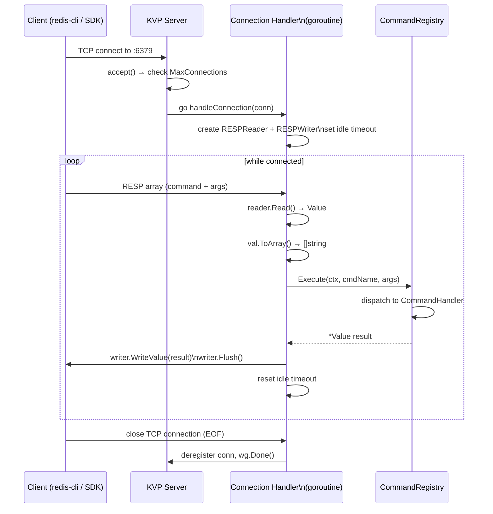
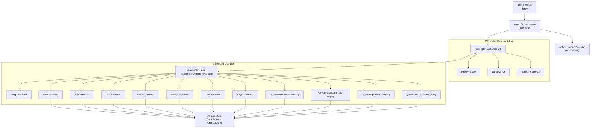
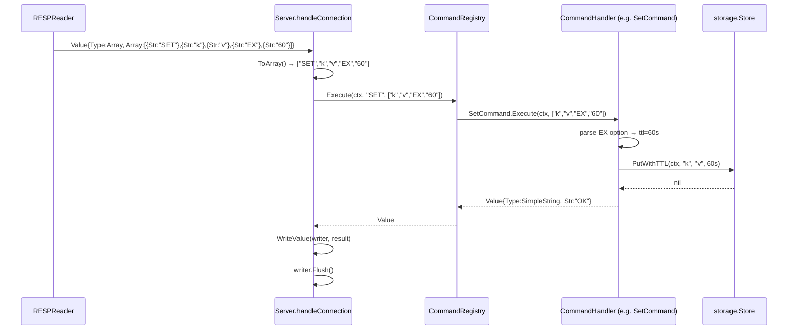

# KVP Protocol (Redis-Compatible)

> RaftKV includes a Redis-compatible TCP server implementing the RESP (REdis Serialization Protocol) wire format. This allows any Redis client library to connect to RaftKV and issue a subset of Redis commands.

## Table of Contents

- [KVP Protocol (Redis-Compatible)](#kvp-protocol-redis-compatible)
  - [Table of Contents](#table-of-contents)
  - [Overview](#overview)
  - [Protocol: RESP](#protocol-resp)
    - [Data Types](#data-types)
    - [Type Format Reference](#type-format-reference)
    - [Message Format Diagram](#message-format-diagram)
  - [Supported Commands](#supported-commands)
    - [Core Commands](#core-commands)
    - [TTL Commands](#ttl-commands)
    - [List Commands](#list-commands)
  - [Connection Lifecycle](#connection-lifecycle)
  - [Server Architecture](#server-architecture)
  - [Command Execution Flow](#command-execution-flow)
  - [Running the KVP Server](#running-the-kvp-server)
  - [Configuration Reference](#configuration-reference)
  - [Limitations vs Redis](#limitations-vs-redis)
  - [See Also](#see-also)

---

## Overview

The KVP (Key-Value Protocol) server is implemented in `internal/kvp/`. It listens on a TCP port (default `:6379`, matching the Redis default) and speaks the RESP protocol. Under the hood, all KVP commands read and write through RaftKV's standard `storage.Store` interface, so data is durable and, in a cluster, Raft-replicated.

The KVP server is started by the separate binary `cmd/kvpserver`. It is independent of the main HTTP/gRPC server and can be run alongside it or as a standalone component.

---

## Protocol: RESP

The protocol is an implementation of [RESP (REdis Serialization Protocol)](https://redis.io/docs/reference/protocol-spec/). RESP 2 and a partial RESP 3 type (`_` null) are supported.

### Data Types

| Type byte | Name | Description |
|---|---|---|
| `+` | Simple String | Short status reply, no binary safe |
| `-` | Error | Error message string |
| `:` | Integer | 64-bit signed integer |
| `$` | Bulk String | Binary-safe string with explicit length |
| `*` | Array | Ordered list of RESP values |
| `_` | Null (RESP3) | Null value (no data) |

All RESP messages are terminated with `\r\n` (CRLF).

### Type Format Reference

```
Simple String:  +OK\r\n
Error:          -ERR unknown command 'FOO'\r\n
Integer:        :42\r\n
Bulk String:    $6\r\nfoobar\r\n
Null Bulk:      $-1\r\n
Array (2):      *2\r\n$3\r\nfoo\r\n$3\r\nbar\r\n
Null Array:     *-1\r\n
```

### Message Format Diagram

A client command is always encoded as a RESP Array of Bulk Strings:

```
Client sends:   SET mykey myvalue EX 60

On the wire:

  *4\r\n          ← array of 4 elements
  $3\r\n          ← bulk string, length 3
  SET\r\n         ← command name
  $5\r\n          ← bulk string, length 5
  mykey\r\n       ← key argument
  $7\r\n          ← bulk string, length 7
  myvalue\r\n     ← value argument
  $2\r\n          ← bulk string, length 2
  EX\r\n          ← option name
  $2\r\n          ← bulk string, length 2
  60\r\n          ← option value
```

Server response for success:

```
  +OK\r\n
```

---

## Supported Commands

### Core Commands

| Command | Syntax | Returns | Description |
|---|---|---|---|
| `PING` | `PING [message]` | `+PONG` or bulk message | Connection health check |
| `GET` | `GET key` | bulk string or null | Retrieve value by key |
| `SET` | `SET key value [EX seconds] [NX\|XX]` | `+OK` or null | Store a value |
| `DEL` | `DEL key [key ...]` | integer (count deleted) | Delete one or more keys |
| `EXISTS` | `EXISTS key` | `1` or `0` | Check key existence |
| `KEYS` | `KEYS pattern` | array of strings | List keys matching pattern |

**SET options:**

| Option | Description |
|---|---|
| `EX seconds` | Set key with a TTL (seconds). Stored via `PutWithTTL`. |
| `NX` | Only set if key does NOT exist. Returns null if key exists. |
| `XX` | Only set if key DOES exist. Returns null if key is absent. |

> **KEYS pattern support:** Only `*` (match all) and `prefix*` (prefix scan) are supported. Full glob/regex patterns (e.g., `h?llo`, `h[ae]llo`) are not implemented. A bare non-wildcard string is treated as an exact match.

### TTL Commands

| Command | Syntax | Returns | Description |
|---|---|---|---|
| `EXPIRE` | `EXPIRE key seconds` | `1` (success) or `0` (key not found) | Set TTL on existing key |
| `TTL` | `TTL key` | seconds remaining, `-1` (no TTL), or `-2` (key missing) | Query TTL |

### List Commands

RaftKV implements a simplified list stored as a newline-delimited string in the backing KV store.

| Command | Syntax | Returns | Description |
|---|---|---|---|
| `LPUSH` | `LPUSH key value [value ...]` | integer (new list length) | Prepend values |
| `RPUSH` | `RPUSH key value [value ...]` | integer (new list length) | Append values |
| `LPOP` | `LPOP key` | bulk string or null | Remove and return head |
| `RPOP` | `RPOP key` | bulk string or null | Remove and return tail |

> **Important:** The list implementation stores elements as newline (`\n`) separated strings in a single KV entry. Values containing newlines will be corrupted. This is a simplified compatibility layer; it is not a production-grade list data structure.

---

## Connection Lifecycle



**Timeout behavior:**
- `ReadTimeout` (default 30s): sets `conn.SetReadDeadline` before each `Read`. Exceeded → connection closed.
- `WriteTimeout` (default 30s): sets a `context.Timeout` for the command execution.
- `IdleTimeout` (default 5min): sets `conn.SetDeadline` after each request cycle. An idle connection that sends no commands within this window is closed.

---

## Server Architecture



`CommandRegistry` is populated once at server startup. Command names are case-insensitive (normalized to uppercase before lookup).

---

## Command Execution Flow



On error (unknown command, wrong argument count, storage failure), the handler returns a RESP Error type (`-ERR ...`) which is written back to the client.

---

## Running the KVP Server

The KVP server binary is `cmd/kvpserver/main.go`.

```bash
# Start the KVP server (defaults to :6379, using a local data directory)
./bin/kvpserver --addr :6379 --data-dir ./data/kvp

# Verify with redis-cli
redis-cli -p 6379 PING
# PONG

redis-cli -p 6379 SET greeting "hello world" EX 300
# OK

redis-cli -p 6379 GET greeting
# "hello world"

redis-cli -p 6379 TTL greeting
# (integer) 298
```

Any Redis client library (Go, Python, Node.js, etc.) that speaks RESP 2 can connect to this server.

---

## Configuration Reference

`ServerConfig` (set via `DefaultServerConfig()` or programmatically):

| Field | Default | Description |
|---|---|---|
| `Addr` | `:6379` | TCP listen address |
| `ReadTimeout` | `30s` | Max time to read a single command |
| `WriteTimeout` | `30s` | Max time to execute and write a response |
| `MaxConnections` | `10000` | Concurrent connection limit; excess connections are rejected |
| `IdleTimeout` | `5m` | Close idle connections after this duration |
| `ShutdownTimeout` | `30s` | Graceful shutdown: wait this long for active connections |

---

## Limitations vs Redis

The KVP server implements a **subset** of the Redis command set. The following Redis features are **not** supported:

| Feature | Status |
|---|---|
| Pub/Sub (`SUBSCRIBE`, `PUBLISH`) | Not implemented |
| Transactions (`MULTI`, `EXEC`, `DISCARD`) | Not implemented |
| Lua scripting (`EVAL`) | Not implemented |
| Sorted sets (`ZADD`, `ZRANGE`, etc.) | Not implemented |
| Hashes (`HSET`, `HGET`, etc.) | Not implemented |
| Streams (`XADD`, `XREAD`, etc.) | Not implemented |
| Pipelining | Not implemented (each command gets its own response) |
| AUTH command | Not implemented (use HTTP auth layer instead) |
| SELECT (databases) | Not implemented (single namespace) |
| Full glob patterns in KEYS | Partial (prefix and `*` only) |
| Binary-safe list elements | Not safe (newline delimiter) |
| Persistence config (AOF, RDB) | Managed by underlying DurableStore/WAL |

For full Redis compatibility, use a Redis instance or Redis-compatible proxy in front of RaftKV's HTTP/gRPC API.

---

## See Also

- `docs/API_REFERENCE.md` — HTTP/gRPC API reference
- `docs/ARCHITECTURE.md` — System architecture
- `internal/kvp/protocol.go` — RESP reader/writer implementation
- `internal/kvp/commands.go` — All command handlers
- `internal/kvp/server.go` — TCP server and connection lifecycle
