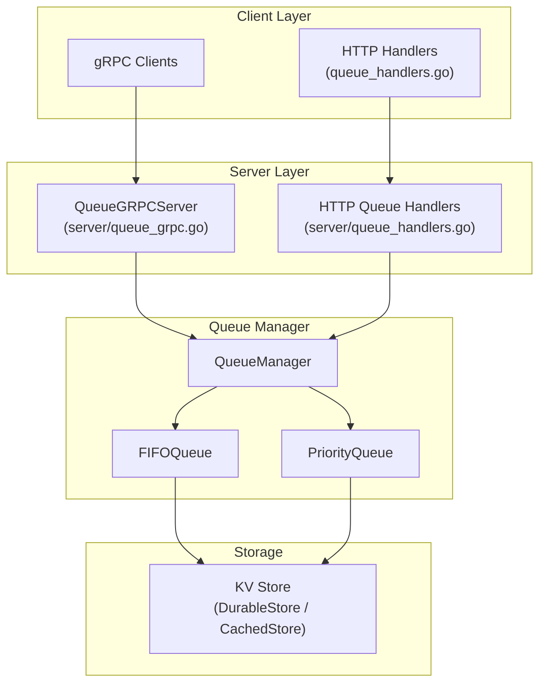
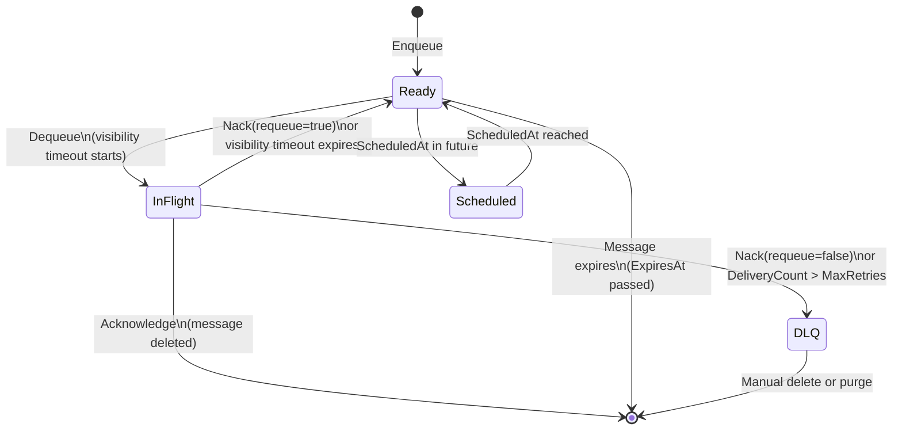
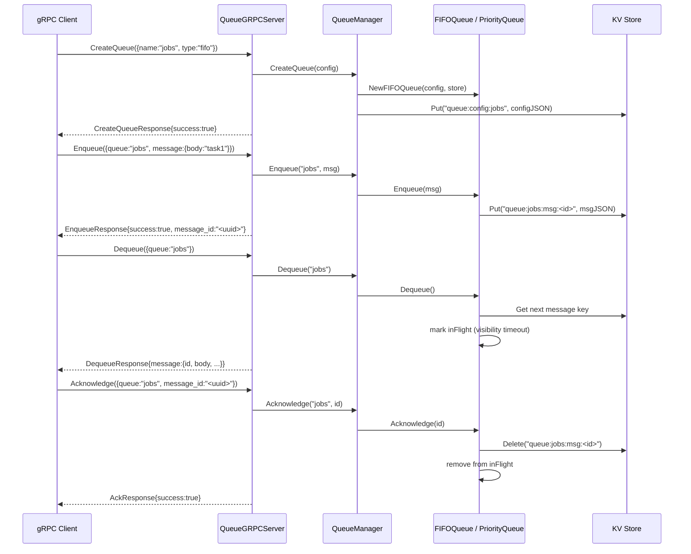

# Queue Subsystem

> RaftKV includes a built-in durable queue subsystem supporting FIFO and priority queues with visibility timeout, dead-letter queues (DLQ), scheduled delivery, and a gRPC API.

## Table of Contents

- [Queue Subsystem](#queue-subsystem)
  - [Table of Contents](#table-of-contents)
  - [Overview](#overview)
  - [Architecture](#architecture)
  - [Message Model](#message-model)
  - [Queue Types](#queue-types)
    - [FIFO Queue](#fifo-queue)
    - [Priority Queue](#priority-queue)
  - [Message Lifecycle](#message-lifecycle)
  - [Dead Letter Queue (DLQ)](#dead-letter-queue-dlq)
  - [Scheduled Messages](#scheduled-messages)
  - [Queue Manager](#queue-manager)
  - [gRPC API](#grpc-api)
    - [Queue Management RPCs](#queue-management-rpcs)
    - [Message RPCs](#message-rpcs)
    - [gRPC Flow Diagram](#grpc-flow-diagram)
  - [Storage Layout](#storage-layout)
  - [Configuration Reference](#configuration-reference)
  - [Operational Notes](#operational-notes)
  - [See Also](#see-also)

---

## Overview

The queue subsystem is built directly on top of RaftKV's storage engine. Each message is persisted as a key-value entry, making queues automatically durable and, in a cluster, replicated via Raft. The subsystem does not require an external message broker.

Two queue types are available:

| Type | Key | Use Case |
|---|---|---|
| `fifo` | `fifo` or `""` | General-purpose ordered processing |
| `priority` | `priority` | Tasks with urgency levels |

---

## Architecture



---

## Message Model

```go
type Message struct {
    ID            string            // UUID, generated on NewMessage()
    QueueName     string
    Body          []byte            // Arbitrary payload
    Priority      int               // Higher = more urgent (default 0)
    Headers       map[string]string // Application-level metadata
    CreatedAt     time.Time
    ScheduledAt   *time.Time        // nil = deliver immediately
    ExpiresAt     *time.Time        // nil = never expires
    DeliveryCount int               // Incremented on each Dequeue
    LastDelivered *time.Time
    DLQReason     string            // Set when moved to DLQ
}
```

Messages are JSON-serialized (custom marshal/unmarshal with nanosecond-precision timestamps) before being written to the backing store.

**Convenience builders:**
```go
msg := NewMessage("my-queue", []byte("payload")).
    WithPriority(10).
    WithScheduledAt(time.Now().Add(5 * time.Minute)).
    WithExpiresAt(time.Now().Add(1 * time.Hour)).
    WithHeader("correlation-id", "abc123")
```

---

## Queue Types

### FIFO Queue

`FIFOQueue` (`internal/queue/fifo.go`) delivers messages in first-in-first-out order. Messages are stored in the KV store with a sequence-based key. A background goroutine (`visibilityTimeoutLoop`) periodically scans in-flight messages and returns them to the queue if their visibility timeout has elapsed without acknowledgement.

**In-flight tracking:** When a message is dequeued, it is moved to an `inFlight` map keyed by message ID, with a `visibleAt` timestamp. The message remains in the backing store but is invisible to other consumers until either acknowledged, nacked, or the visibility timeout expires.

### Priority Queue

`PriorityQueue` (`internal/queue/priority.go`) delivers messages in descending priority order (higher `Priority` value dequeued first). Within the same priority level, messages are delivered FIFO.

---

## Message Lifecycle



**State descriptions:**

| State | Description |
|---|---|
| Ready | Available for consumers to dequeue |
| Scheduled | Waiting for `ScheduledAt`; not returned by `Dequeue` |
| InFlight | Dequeued; consumer has `VisibilityTimeout` to acknowledge |
| Acknowledged | Permanently deleted from store |
| DLQ | Moved to dead-letter queue after exhausting retries |

---

## Dead Letter Queue (DLQ)

When `DLQEnabled: true`, a companion queue named `<queue-name>-dlq` (configurable via `DLQName`) is created automatically. Messages are routed to the DLQ when:

1. `Nack(messageID, requeue=false)` is called explicitly, or
2. `DeliveryCount > MaxRetries` (the maximum number of delivery attempts is exceeded).

The `DLQReason` field on the moved message records why it was dead-lettered.

DLQ messages can be inspected, re-driven manually, or purged. The DLQ is itself a queue (FIFO) and supports all the same operations.

---

## Scheduled Messages

A message with a non-nil `ScheduledAt` timestamp is not returned by `Dequeue` until `time.Now() >= ScheduledAt`.

`QueueManager.StartScheduledMessageProcessor(interval)` starts a background goroutine that calls `ProcessScheduledMessages` on the given interval. `ProcessScheduledMessages` iterates over all queues and logs the count of scheduled messages for each (actual promotion to ready state is handled by the queue implementation on `Dequeue`).

---

## Queue Manager

`QueueManager` (`internal/queue/manager.go`) is the single point of access for all queue operations. It maintains an in-memory map of queue name → `Queue` interface.

**Persistence:** Queue configurations are stored in the backing KV store under `queue:config:<name>`. On startup, `LoadQueues()` reads all config keys and recreates the in-memory queue instances, allowing queue definitions to survive restarts.

**Thread safety:** All `QueueManager` methods that access the queue map are protected by `sync.RWMutex`.

**Batch operations:**

| Method | Description |
|---|---|
| `BatchEnqueue(queue, msgs)` | Enqueue multiple messages; returns per-message error slice |
| `BatchDequeue(queue, count)` | Dequeue up to `count` messages |
| `BatchAcknowledge(queue, ids)` | Acknowledge multiple messages |

---

## gRPC API

The queue service is defined in `api/proto/queue.pb.go` and implemented by `QueueGRPCServer` (`internal/server/queue_grpc.go`).

### Queue Management RPCs

| RPC | Request | Response | Description |
|---|---|---|---|
| `CreateQueue` | `CreateQueueRequest{config}` | `CreateQueueResponse{success, config}` | Create a new queue |
| `DeleteQueue` | `DeleteQueueRequest{name}` | `DeleteQueueResponse{success}` | Delete queue and all messages |
| `ListQueues` | `ListQueuesRequest{}` | `ListQueuesResponse{queues[]}` | List all queue configs |
| `GetQueueStats` | `GetQueueStatsRequest{name}` | `GetQueueStatsResponse{stats}` | Length, delivered count, DLQ count, etc. |

**QueueConfig fields (protobuf):**

| Field | Type | Description |
|---|---|---|
| `name` | string | Queue name |
| `type` | string | `fifo` or `priority` |
| `max_length` | int32 | Max messages (0 = unlimited) |
| `max_retries` | int32 | Max delivery attempts before DLQ |
| `message_ttl_ms` | int64 | Message TTL in milliseconds |
| `visibility_timeout_ms` | int64 | Visibility timeout in milliseconds |
| `dlq_enabled` | bool | Enable dead-letter queue |
| `dlq_name` | string | DLQ name override |

### Message RPCs

| RPC | Request | Response | Description |
|---|---|---|---|
| `Enqueue` | `EnqueueRequest{queue_name, message}` | `EnqueueResponse{success, message_id}` | Add message to queue |
| `Dequeue` | `DequeueRequest{queue_name}` | `DequeueResponse{success, message}` | Get and lock next message |
| `Peek` | `PeekRequest{queue_name}` | `PeekResponse{success, message}` | Read next message without locking |
| `Acknowledge` | `AckRequest{queue_name, message_id}` | `AckResponse{success}` | Mark message as processed |
| `Nack` | `NackRequest{queue_name, message_id, requeue}` | `NackResponse{success}` | Return to queue or send to DLQ |
| `DeleteMessage` | `DeleteRequest{queue_name, message_id}` | `DeleteResponse{success}` | Remove specific message |
| `GetMessage` | `GetMessageRequest{queue_name, message_id}` | `GetMessageResponse{success, message}` | Retrieve by ID |
| `PurgeQueue` | `PurgeQueueRequest{name}` | `PurgeQueueResponse{success}` | Remove all messages |

### gRPC Flow Diagram



---

## Storage Layout

Queue data is stored in the backing KV store with the following key patterns:

| Key Pattern | Content |
|---|---|
| `queue:config:<name>` | JSON-encoded `QueueConfig` |
| `queue:<name>:msg:<id>` | JSON-encoded `Message` |
| `queue:<name>:dlq:<id>` | JSON-encoded dead-lettered `Message` |

This layout allows `store.List("queue:<name>:msg:", 0)` to enumerate all messages in a queue efficiently.

---

## Configuration Reference

`QueueConfig` defaults (returned by `DefaultQueueConfig(name)`):

| Field | Default | Description |
|---|---|---|
| `Type` | `fifo` | Queue type |
| `MaxLength` | `10000` | Maximum queue length |
| `MaxRetries` | `3` | Delivery attempts before DLQ |
| `MessageTTL` | `0` | No message expiration |
| `VisibilityTimeout` | `30s` | Time consumer has to acknowledge |
| `DLQEnabled` | `true` | Enable dead-letter queue |
| `DLQName` | `<name>-dlq` | DLQ queue name |

---

## Operational Notes

- **Visibility timeout tuning:** Set `VisibilityTimeout` to be comfortably longer than the expected processing time. Too-short timeouts cause messages to be redelivered to other consumers while the original consumer is still processing.
- **MaxRetries:** Keep `MaxRetries` low (3–5) to avoid repeatedly processing poison messages that will never succeed. These should go to the DLQ promptly for investigation.
- **Queue length limits:** `MaxLength: 0` means unlimited. In production, always set a limit to prevent unbounded memory growth.
- **Raft replication:** All queue operations go through the KV store, which is replicated via Raft. This means queue writes have linearizable guarantees but also pay the latency cost of Raft consensus.
- **No persistence of in-flight state across restarts:** The `inFlight` map is in-memory only. After a process restart, all in-flight messages with elapsed visibility timeouts become visible again on the next `visibilityTimeoutLoop` cycle.

---

## See Also

- `docs/API_REFERENCE.md` — HTTP queue endpoints
- `docs/ARCHITECTURE.md` — System architecture
- `api/proto/queue.pb.go` — gRPC service definition
