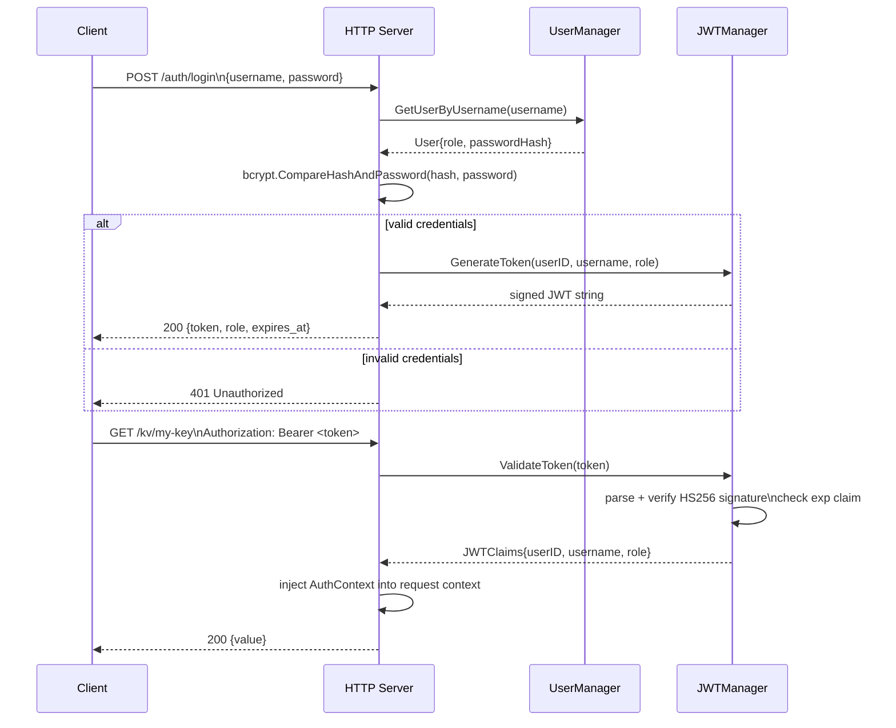
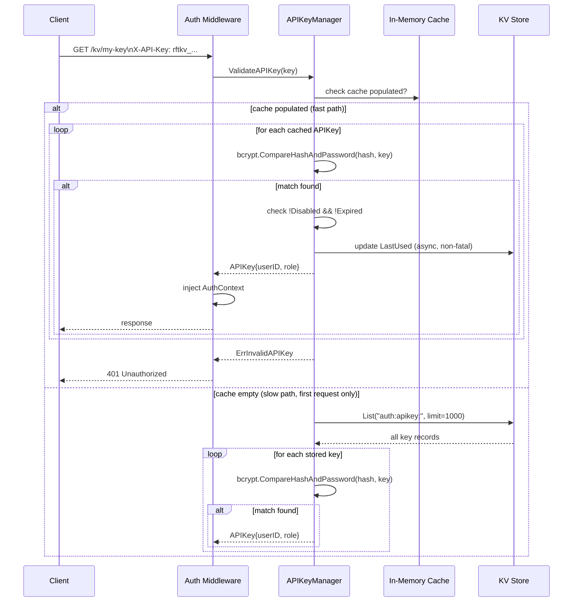
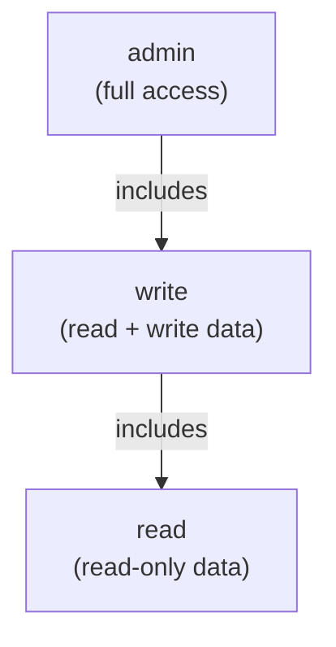
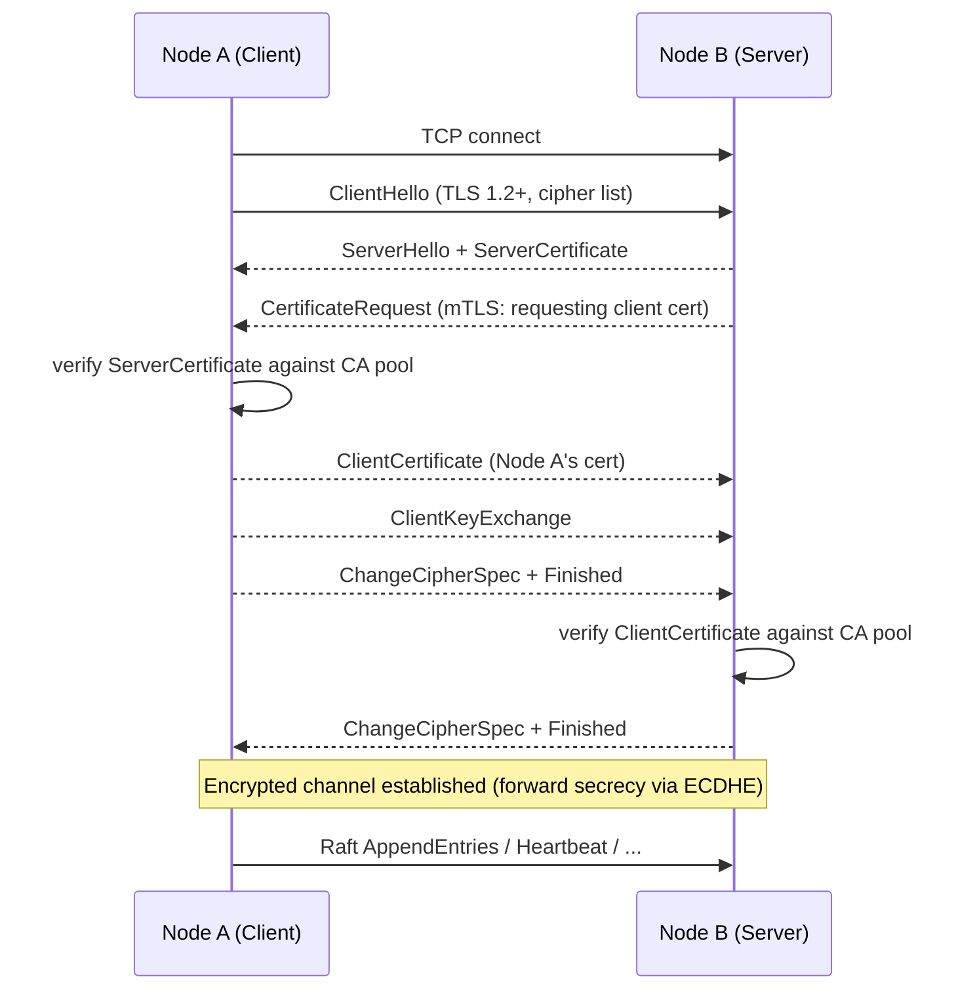

# Security Model

> Comprehensive security model for RaftKV: authentication, authorization, API key management, TLS/mTLS, rate limiting, CORS, and cluster token protection.

## Table of Contents

- [Security Model](#security-model)
  - [Table of Contents](#table-of-contents)
  - [Overview](#overview)
  - [Authentication](#authentication)
    - [JWT Authentication](#jwt-authentication)
    - [API Key Authentication](#api-key-authentication)
    - [Middleware Resolution Order](#middleware-resolution-order)
  - [Authorization (RBAC)](#authorization-rbac)
    - [Role Hierarchy](#role-hierarchy)
    - [Endpoint Permission Matrix](#endpoint-permission-matrix)
  - [User Management](#user-management)
  - [TLS and mTLS](#tls-and-mtls)
    - [Client-Server TLS](#client-server-tls)
    - [Raft Inter-Node mTLS](#raft-inter-node-mtls)
    - [TLS Handshake Flow](#tls-handshake-flow)
  - [Cluster Management Token](#cluster-management-token)
  - [Rate Limiting](#rate-limiting)
  - [CORS](#cors)
  - [Security Defaults Summary](#security-defaults-summary)
  - [See Also](#see-also)

---

## Overview

RaftKV implements a layered security model:

1. **Transport security** — TLS 1.2+ for client-server; mutual TLS (mTLS) for Raft inter-node communication.
2. **Authentication** — Every API request must carry either a JWT bearer token or an API key (when auth is enabled).
3. **Authorization** — RBAC with three roles (`admin`, `write`, `read`) enforced per endpoint.
4. **Cluster token** — A shared secret that must be present on cluster join/remove operations to prevent unauthorized topology changes.
5. **Rate limiting** — Per-IP token-bucket rate limiter on the HTTP layer.
6. **CORS** — Configurable allowed origins for browser clients.

Authentication can be disabled entirely (e.g., for trusted internal networks or development) by setting `auth.enabled: false` in the config. When disabled, all middleware checks are skipped and all requests are allowed through.

---

## Authentication

### JWT Authentication

JWT (JSON Web Token) tokens use HMAC-SHA256 (`HS256`) signing. The signing key is a shared secret configured at startup.

**Token claims:**

| Claim | Type | Description |
|---|---|---|
| `user_id` | string | UUID of the user |
| `username` | string | Human-readable username |
| `role` | string | `admin`, `write`, or `read` |
| `iss` | string | Always `raftkv` |
| `iat` | int64 | Issued-at Unix timestamp |
| `exp` | int64 | Expiry Unix timestamp |

**Token lifetime** is configurable (e.g., `jwt.token_duration: 24h`). A `RefreshToken` endpoint issues a new token from a still-valid token without requiring re-authentication with credentials.



### API Key Authentication

API keys are long-lived credentials suited for server-to-server or automation use cases. They are identified by the `X-API-Key` HTTP header.

**Key format:** `rftkv_` prefix followed by 32 bytes of random data, base64url-encoded. Example: `rftkv_dGhpcyBpcyBhIHRlc3Qga2V5...`

**Storage:** The plaintext key is shown only at creation time. Only the bcrypt hash (cost=12) is persisted in the backing store under the key prefix `auth:apikey:<id>`.

**Cache-first validation:**



> **Performance note:** bcrypt at cost=12 takes ~300ms per comparison. For large numbers of API keys, all comparisons must be attempted because hash comparison cannot be short-circuited without the plaintext key. To mitigate this, the cache is loaded at startup (`LoadCache`) so that most requests take the fast path with a bounded iteration over cached hashes.

**Lifecycle operations:**

| Operation | Effect |
|---|---|
| `GenerateAPIKey` | Creates key, stores hash, populates cache |
| `RevokeAPIKey` | Sets `Disabled=true`, removes from cache |
| `DeleteAPIKey` | Permanently removes from store and cache |
| `ListAPIKeys` | Returns all keys (plaintext key field omitted) |

### Middleware Resolution Order

The authentication middleware (`internal/auth/middleware.go`) checks credentials in this order:

1. If `X-API-Key` header is present → API key authentication.
2. If `Authorization: Bearer <token>` header is present → JWT authentication.
3. Neither present → `401 Authentication required`.

Only one method is used per request; they are not combined.

---

## Authorization (RBAC)

### Role Hierarchy



Role inheritance is implemented in `Role.HasPermission(requiredRole)`:

- `admin` passes any permission check.
- `write` passes checks for `write` or `read`.
- `read` passes only `read` checks.

### Endpoint Permission Matrix

| Endpoint | Required Role |
|---|---|
| `POST /auth/login` | public |
| `POST /auth/refresh` | authenticated (any role) |
| `GET /kv/{key}` | `read` |
| `PUT /kv/{key}` | `write` |
| `DELETE /kv/{key}` | `write` |
| `GET /kv` (list) | `read` |
| `POST /auth/users` | `admin` |
| `GET /auth/users` | `admin` |
| `POST /auth/apikeys` | `admin` |
| `DELETE /auth/apikeys/{id}` | `admin` |
| `POST /cluster/join` | `admin` + cluster token |
| `POST /cluster/remove` | `admin` + cluster token |
| `GET /metrics` | public (Prometheus scrape) |
| `GET /health` | public |

---

## User Management

Users are stored in the backing KV store under the key prefix `auth:user:`. Passwords are hashed with bcrypt at cost 12 before storage; plaintext passwords are never persisted.

`UserManager` methods:

| Method | Description |
|---|---|
| `CreateUser(username, password, role)` | Creates user, checks for duplicate username |
| `GetUser(id)` | Retrieve by UUID |
| `GetUserByUsername(username)` | Retrieve by username (used during login) |
| `UpdateUserRole(id, role)` | Change role |
| `DisableUser(id)` | Soft-disable (sets `Disabled=true`) |
| `DeleteUser(id)` | Hard delete from store |
| `ListUsers()` | List all users (no password hashes returned) |
| `Authenticate(username, password)` | Verify credentials, returns `User` |

---

## TLS and mTLS

TLS configuration is managed in `internal/security/tls.go`. Three distinct TLS configurations are supported:

| Use Case | Config Function | Notes |
|---|---|---|
| HTTP client-server | `LoadServerTLSConfig` | Optional mTLS via `EnableMTLS` |
| Raft inter-node | `LoadRaftTLSConfig` | mTLS always on (mutual) |
| HTTP clients | `LoadClientTLSConfig` | Optional client cert for mTLS |

**Minimum TLS version:** 1.2. Version 1.0 and 1.1 are rejected.

**Allowed cipher suites** (preference order):
- TLS 1.3: `AES-128-GCM-SHA256`, `AES-256-GCM-SHA384`, `ChaCha20-Poly1305`
- TLS 1.2 (ECDHE only for forward secrecy): `ECDHE-RSA-AES128-GCM-SHA256`, `ECDHE-RSA-AES256-GCM-SHA384`, `ECDHE-ECDSA-*`, `ECDHE-RSA-CHACHA20-POLY1305`

Weak ciphers (RC4, 3DES, CBC without AEAD) and non-ECDHE key exchange are excluded.

### Client-Server TLS

Configured via `RaftHTTPServerConfig.TLSConfig`. When non-nil, the HTTP server starts with HTTPS. Optionally, `EnableMTLS: true` requires the client to present a certificate signed by `ClientCAFile`.

### Raft Inter-Node mTLS

`TLSStreamLayer` wraps the Raft transport with TLS. Each node presents its own certificate when both accepting and dialing connections (`tls.RequireAndVerifyClientCert`). All nodes must be signed by the same CA, making the CA the trust anchor for cluster membership.

The `Dial` method on `TLSStreamLayer` is called by HashiCorp Raft to establish outbound connections to peer nodes.

### TLS Handshake Flow



---

## Cluster Management Token

`/cluster/join` and `/cluster/remove` endpoints require an `Authorization: Bearer <cluster_token>` header in addition to normal auth. The cluster token is a shared secret configured at startup via `ClusterToken` in `RaftHTTPServerConfig`.

This is a separate credential from user JWT tokens. It prevents an authenticated admin user on one cluster from accidentally joining nodes to a different cluster if the JWT secret is shared.

When `ClusterToken` is empty string (not recommended in production), the token check is skipped.

---

## Rate Limiting

`RateLimitMiddleware` in `internal/server/middleware.go` implements a per-IP token-bucket algorithm.

**Algorithm:**
1. Each IP address gets its own `ipBucket` with `tokens = requestsPerSecond` initially.
2. On each request, elapsed time since the last refill is computed and tokens are added at `rate = requestsPerSecond / second`.
3. Tokens are capped at `burst = requestsPerSecond`.
4. If `tokens < 1`, the request is rejected with `429 Too Many Requests`.
5. Otherwise, one token is consumed.

**Client IP detection:** The middleware respects the `X-Forwarded-For` header (for reverse proxy deployments). If absent, `RemoteAddr` is used.

**Configuration:** `EnableRateLimit: true`, `RateLimit: N` (requests per second) in `RaftHTTPServerConfig`.

---

## CORS

`CORSMiddleware` in `internal/server/middleware.go` adds CORS headers to every response.

**Behavior:**
- If `allowedOrigins` is empty, `Access-Control-Allow-Origin: *` is set (allows any origin).
- If `allowedOrigins` is non-empty, the request `Origin` header is matched against the list. If matched, that origin is echoed back and a `Vary: Origin` header is added.
- Unmatched origins receive no `Access-Control-Allow-Origin` header (browser will block).

**Fixed allowed methods and headers:**
```
Access-Control-Allow-Methods: GET, PUT, POST, DELETE, OPTIONS
Access-Control-Allow-Headers: Content-Type, Authorization
```

Preflight (`OPTIONS`) requests are responded to immediately with `200 OK`.

---

## Security Defaults Summary

| Setting | Default | Production Recommendation |
|---|---|---|
| Auth enabled | `true` | Keep enabled |
| JWT signing algorithm | HS256 | Rotate signing key regularly |
| JWT token duration | configurable | 1–24 hours |
| API key bcrypt cost | 12 | Do not lower |
| Min TLS version | 1.2 | Consider 1.3-only |
| Raft mTLS | optional | Enable in production |
| Cluster token | empty (disabled) | Always set in production |
| Rate limit | disabled | Enable in production |
| CORS origins | `*` | Restrict to known origins |
| WAL sync on write | `false` | Set `true` for durability |

---

## See Also

- `docs/ARCHITECTURE.md` — High-level security section
- `docs/DEPLOYMENT.md` — TLS certificate setup and cluster token configuration
- `config/README.md` — Auth and TLS config fields
