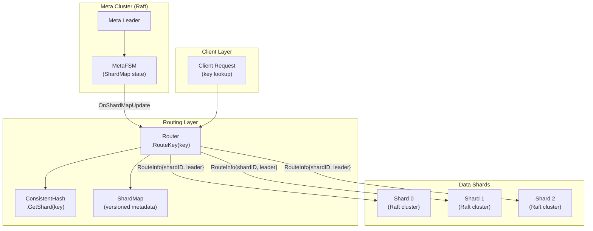
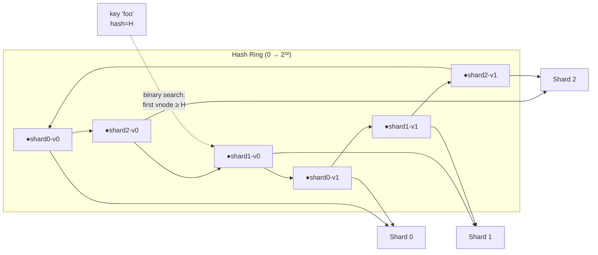
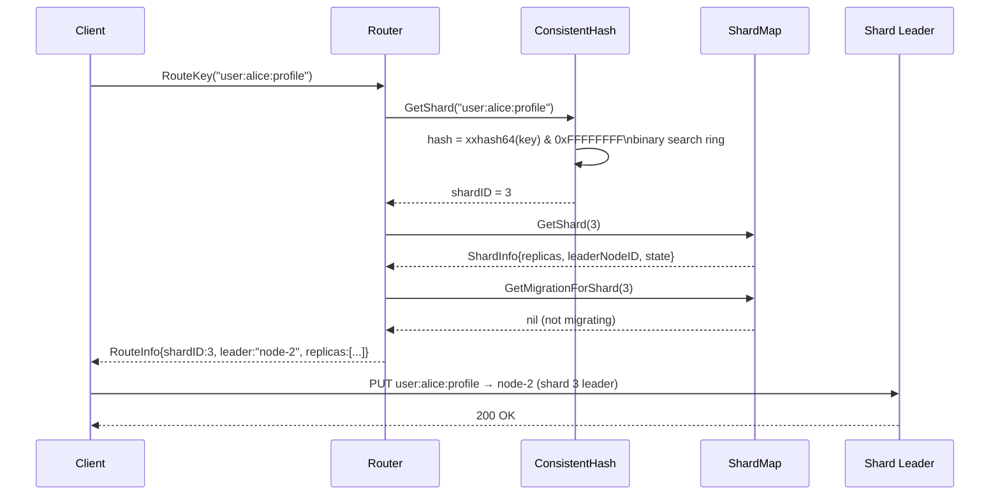
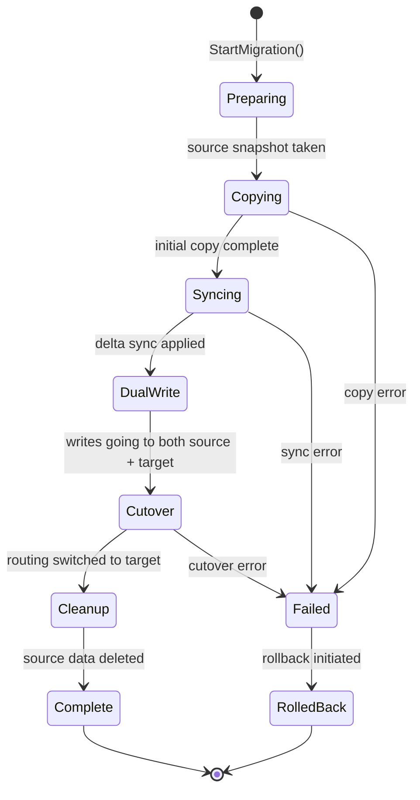
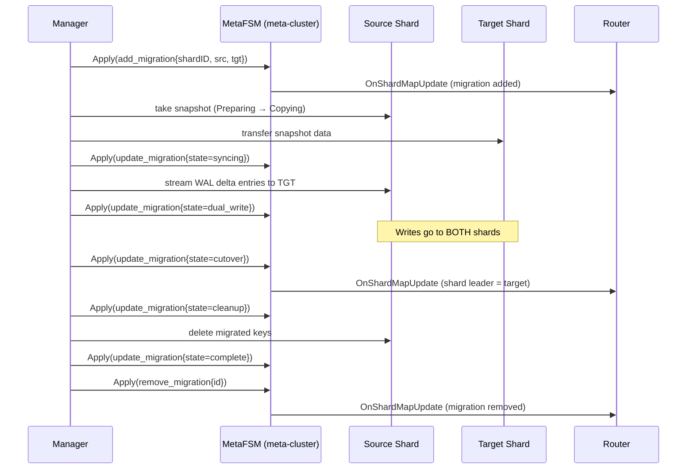

# Sharding Subsystem

> Horizontal sharding for RaftKV using consistent hashing, a distributed shard map managed by a Raft-backed meta-FSM, and a router layer for request routing.

## Table of Contents

- [Sharding Subsystem](#sharding-subsystem)
  - [Table of Contents](#table-of-contents)
  - [Overview](#overview)
  - [Current Implementation Status](#current-implementation-status)
  - [Architecture](#architecture)
  - [Consistent Hashing](#consistent-hashing)
    - [Virtual Nodes](#virtual-nodes)
    - [Hash Ring Diagram](#hash-ring-diagram)
    - [Key-to-Shard Lookup](#key-to-shard-lookup)
  - [Shard Map and Types](#shard-map-and-types)
    - [ShardInfo](#shardinfo)
    - [NodeInfo](#nodeinfo)
    - [MigrationInfo](#migrationinfo)
  - [Meta-FSM](#meta-fsm)
    - [Supported Commands](#supported-commands)
  - [Router](#router)
    - [Request Routing Flow](#request-routing-flow)
  - [Shard Manager](#shard-manager)
    - [Rebalancing](#rebalancing)
  - [Shard Migration](#shard-migration)
    - [Migration State Machine](#migration-state-machine)
    - [Rebalancing Flow](#rebalancing-flow)
  - [See Also](#see-also)

---

## Overview

The sharding subsystem distributes key-value data across multiple independent RaftKV clusters ("shards"). Each shard is itself a Raft cluster that owns a portion of the key space. A separate meta-cluster (also Raft-backed) stores and replicates the authoritative shard map: which shards exist, which nodes host each shard, and the state of any in-progress migrations.

Clients (or a proxy layer) use the `Router` to translate a key into a target shard and then route the request to that shard's leader node.

---

## Current Implementation Status

The sharding subsystem is **scaffolded and partially implemented**. The data structures, consistent hashing, routing, meta-FSM, and migration state machine are all present and well-designed, but the end-to-end automation of shard rebalancing and live migration is still under development.

| Component | Status | Notes |
|---|---|---|
| `ConsistentHash` ring | Complete | `xxhash`, virtual nodes, binary search |
| `ShardMap` / `NodeInfo` / `MigrationInfo` types | Complete | Full CRUD, versioning, clone |
| `MetaFSM` | Complete | Applies shard/node/migration commands via Raft |
| `Router` | Complete | Routes keys, handles `UpdateShardMap` from MetaFSM |
| `Manager` | Partial | Config, context, Raft/FSM wiring complete; auto-rebalancing loop scaffolded |
| `Migrator` | Partial | Migration state machine and checkpointing present; actual data transfer not fully implemented |
| Live key migration | Not implemented | State machine stages defined; transfer logic is a TODO |
| Client-side routing integration | Not implemented | Needs integration with the main HTTP/gRPC server |

---

## Architecture



---

## Consistent Hashing

### Virtual Nodes

Each shard is represented by `numVNodes` virtual nodes on the hash ring (recommended: 150). Virtual nodes give each shard multiple positions on the ring, producing a more even key distribution than a single position per shard, and minimizing key movement when shards are added or removed.

A virtual node's ring position is computed as:

```
hash = xxhash64("shard-<id>-vnode-<i>") truncated to uint32
```

The ring is a sorted `[]uint32` slice. The `vnodeToShard` map translates each hash position to its shard ID.

### Hash Ring Diagram



### Key-to-Shard Lookup

```
1. hash = xxhash64(key) & 0xFFFFFFFF
2. idx = sort.Search(ring, hash)   // first position >= hash
3. if idx == len(ring): idx = 0    // wrap around
4. return vnodeToShard[ring[idx]]
```

When a shard is added: `numVNodes` new positions are inserted and the ring is re-sorted. Only keys that hash into the new shard's virtual node arcs are remapped; all other keys are unaffected.

When a shard is removed: all its virtual node positions are deleted from the ring. Affected keys redistribute to the next clockwise shard.

---

## Shard Map and Types

The `ShardMap` is the authoritative state held by the `MetaFSM`. It is versioned (`Version uint64`, monotonically increasing on every mutation) to detect stale updates.

### ShardInfo

| Field | Type | Description |
|---|---|---|
| `ID` | int | Unique shard identifier |
| `State` | ShardState | `active`, `migrating`, `splitting`, `inactive` |
| `Replicas` | []string | Node IDs hosting this shard |
| `LeaderNodeID` | string | Current Raft leader for the shard |
| `KeyRangeStart/End` | uint32 | Hash range on the consistent ring |
| `DataSize` | int64 | Approximate data size in bytes |
| `KeyCount` | int64 | Number of keys in shard |

### NodeInfo

| Field | Type | Description |
|---|---|---|
| `ID` | string | Unique node identifier |
| `Address` | string | `host:port` |
| `State` | NodeState | `active`, `draining`, `down`, `removed` |
| `Capacity` | int64 | Max data capacity in bytes |
| `Used` | int64 | Current data usage in bytes |
| `Load` | float64 | Current load factor (0.0–1.0) |
| `Shards` | []int | Shard IDs hosted on this node |
| `LastHeartbeat` | time.Time | Last seen timestamp |

### MigrationInfo

Tracks a shard migration from source nodes to target nodes.

| Field | Type | Description |
|---|---|---|
| `ID` | string | UUID |
| `ShardID` | int | Shard being migrated |
| `SourceNodes` | []string | Origin node IDs |
| `TargetNodes` | []string | Destination node IDs |
| `State` | MigrationState | See state machine below |
| `Progress` | float64 | 0.0–1.0 completion fraction |
| `KeysCopied` | int64 | Keys transferred so far |
| `TotalKeys` | int64 | Total keys to transfer |
| `LastCheckpoint` | *Checkpoint | For resumable migration |
| `Error` | string | Set on failure |

---

## Meta-FSM

`MetaFSM` (`internal/sharding/meta_fsm.go`) implements the `raft.FSM` interface for the meta-cluster. It serializes mutations to the `ShardMap` as Raft log entries, ensuring all meta-cluster nodes see the same shard topology.

### Supported Commands

| CommandType | Data Payload | Effect |
|---|---|---|
| `add_shard` | `ShardInfo` | Add shard to ShardMap |
| `remove_shard` | `{shard_id}` | Remove shard from ShardMap |
| `update_shard` | `ShardInfo` | Update shard metadata |
| `add_node` | `NodeInfo` | Register node |
| `remove_node` | `{node_id}` | Remove node from ShardMap |
| `update_node` | `NodeInfo` | Update node metadata |
| `add_migration` | `MigrationInfo` | Register new migration |
| `update_migration` | `MigrationInfo` | Update migration progress/state |
| `remove_migration` | `{migration_id}` | Remove completed/failed migration |

After each `Apply`, the MetaFSM calls `OnShardMapUpdate` on all registered `UpdateListener`s. The `Router` implements `UpdateListener`, so it automatically receives the new `ShardMap` and rebuilds its consistent hash ring.

---

## Router

`Router` (`internal/sharding/router.go`) is the hot path for key routing. It wraps `ConsistentHash` and `ShardMap` behind a single `sync.RWMutex`.

**`RouteKey(key) → RouteInfo`:**

```go
type RouteInfo struct {
    ShardID       int
    Replicas      []string // All node IDs for this shard
    LeaderNodeID  string   // Current leader
    IsMigrating   bool
    MigrationInfo *MigrationInfo
}
```

When `IsMigrating` is true, the client should write to both source and target nodes (dual-write) to ensure no data loss during cutover.

**`UpdateShardMap(newShardMap)`:** Idempotent; ignores updates with version <= current. Adds new shards to the consistent hash ring and removes stale ones. Called automatically via `OnShardMapUpdate` from the MetaFSM.

**`IsHealthy()`:** Returns `false` if the ring is empty or any migration is in `failed` state.

### Request Routing Flow



---

## Shard Manager

`Manager` (`internal/sharding/manager.go`) is responsible for shard lifecycle: creation, deletion, rebalancing, and migration orchestration. It holds references to the `MetaFSM`, `Router`, and the Raft instance for the meta-cluster.

**Configuration:**

| Field | Default | Description |
|---|---|---|
| `RebalanceInterval` | `60s` | How often to evaluate rebalancing |
| `MaxShardSize` | `10 GB` | Trigger split if shard exceeds this |
| `MinShardSize` | `1 GB` | Trigger merge if shard is below this |
| `ReplicationFactor` | `3` | Target replicas per shard |

### Rebalancing

The rebalancing loop (background goroutine) fires every `RebalanceInterval`. It evaluates the current shard distribution and initiates migrations if:
- A shard's `DataSize > MaxShardSize` (split candidate).
- A shard's `DataSize < MinShardSize` (merge candidate).
- Nodes have uneven load (load balancing).

> **Status:** The rebalancing goroutine is wired up but the decision logic and migration initiation are partially implemented. The infrastructure (types, state machine, MetaFSM commands) is complete; the automated trigger conditions are scaffolded with TODOs.

---

## Shard Migration

### Migration State Machine



**State descriptions:**

| State | Description |
|---|---|
| `preparing` | Snapshot of source being taken for initial copy baseline |
| `copying` | Bulk-copying snapshot data to target nodes |
| `syncing` | Applying delta WAL entries produced after snapshot |
| `dual_write` | All writes go to both source and target; reads from source |
| `cutover` | Traffic routing atomically switched to target; verification |
| `cleanup` | Source data deleted; migration finalized |
| `complete` | Migration finished successfully |
| `failed` | Irrecoverable error; source is still authoritative |
| `rolled_back` | Migrated state discarded; traffic returned to source |

**Checkpointing:** `MigrationInfo.LastCheckpoint` stores the last `RaftIndex` and `Timestamp` at which a checkpoint was written. This allows migration to resume from a checkpoint after a failure rather than restarting from scratch.

### Rebalancing Flow



---

## See Also

- `docs/ARCHITECTURE.md` — High-level system overview
- `docs/OPERATIONS.md` — Operational runbook
- `internal/sharding/types.go` — All data types
- `internal/sharding/meta_fsm.go` — MetaFSM command handling
