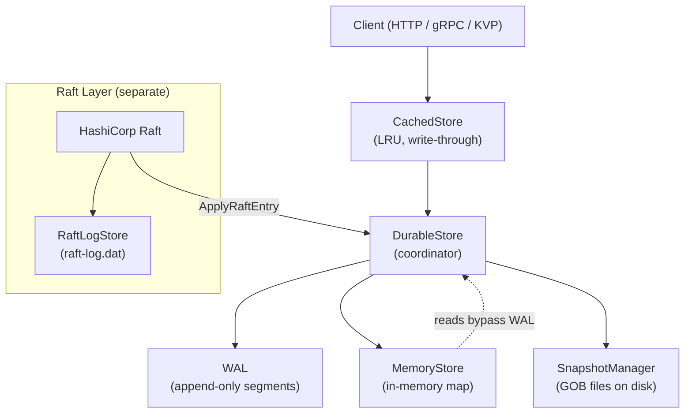
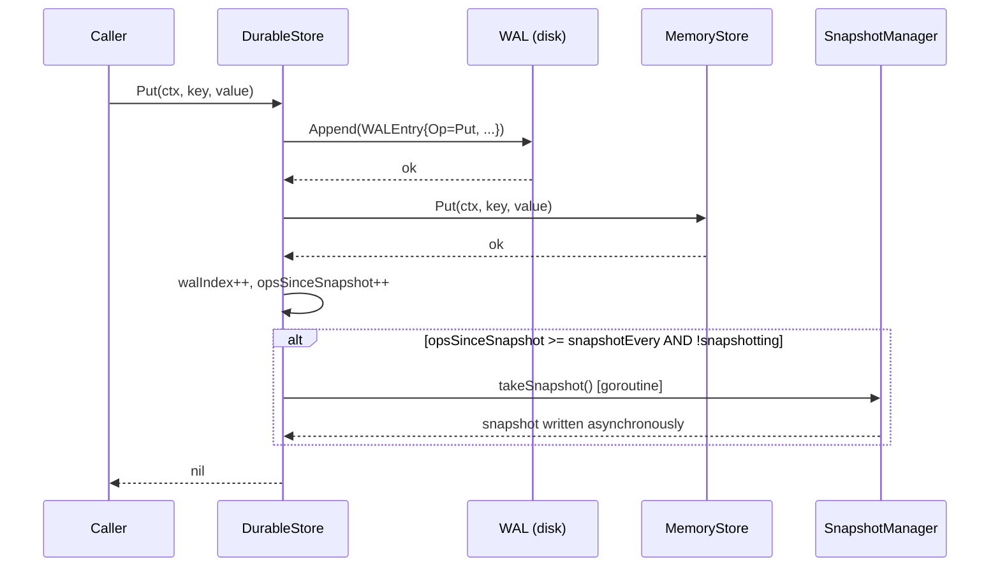
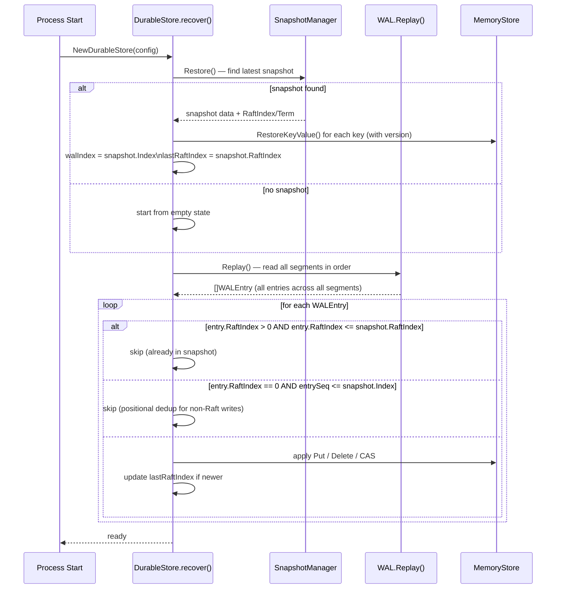
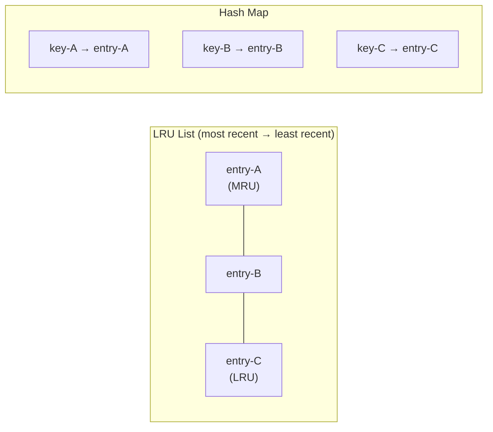
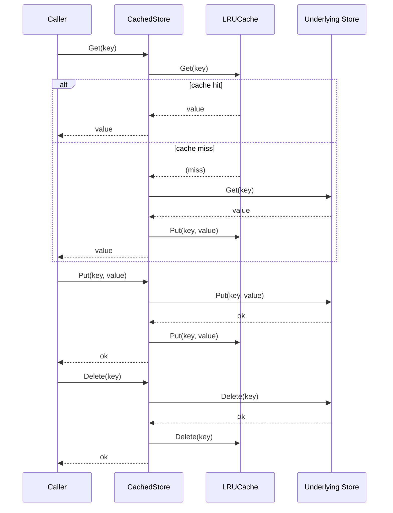
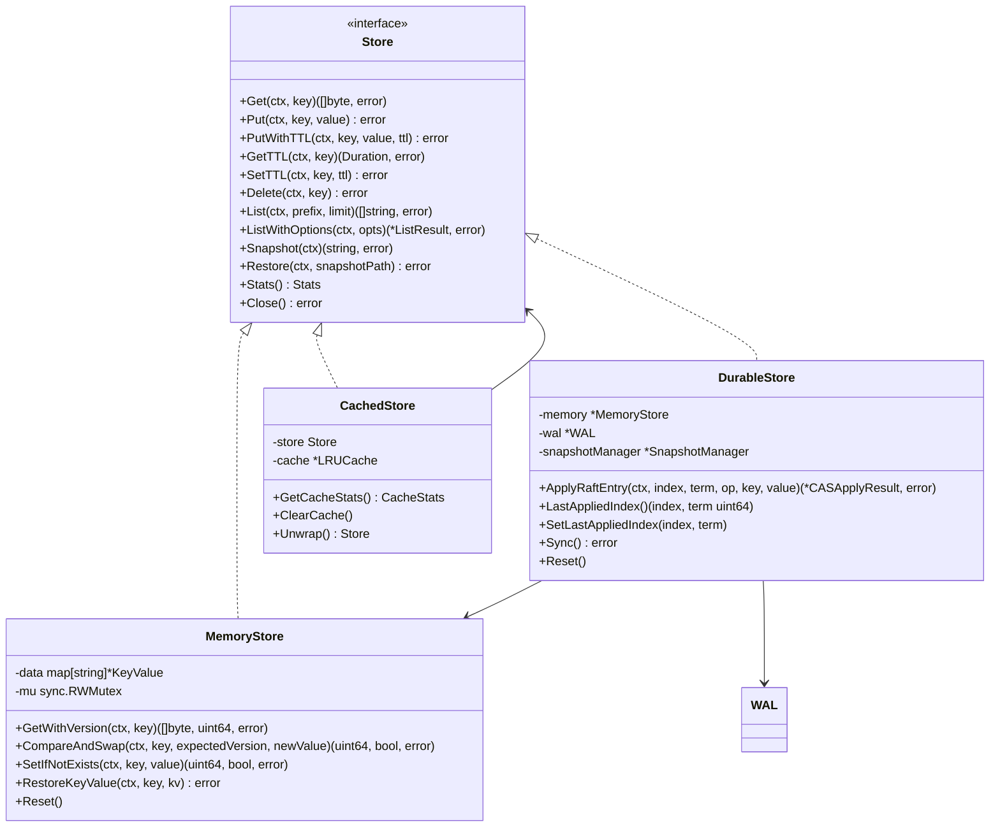

# Storage Internals

> Deep dive into the RaftKV storage layer: WAL binary format, durable recovery, Raft log storage, LRU caching, and in-memory state.

## Table of Contents

- [Storage Internals](#storage-internals)
  - [Table of Contents](#table-of-contents)
  - [Overview](#overview)
  - [Layer Architecture](#layer-architecture)
  - [Write-Ahead Log (WAL)](#write-ahead-log-wal)
    - [Entry Binary Format](#entry-binary-format)
    - [Segment Management](#segment-management)
    - [Compaction](#compaction)
  - [Memory Store](#memory-store)
  - [Durable Store](#durable-store)
    - [Write Path](#write-path)
    - [Recovery Flow](#recovery-flow)
    - [Snapshot Triggering](#snapshot-triggering)
  - [LRU Cache](#lru-cache)
    - [CachedStore (Write-Through)](#cachedstore-write-through)
  - [Raft Log Store](#raft-log-store)
  - [Key Storage Interfaces](#key-storage-interfaces)
  - [TTL (Time-To-Live)](#ttl-time-to-live)
  - [Configuration Reference](#configuration-reference)
    - [DurableStoreConfig](#durablestoreconfig)
    - [CacheConfig](#cacheconfig)
  - [See Also](#see-also)

---

## Overview

The RaftKV storage layer is a stack of composable components that together provide durable, crash-safe key-value storage with optional caching. The stack from top to bottom is:

| Layer | Type | File |
|---|---|---|
| `CachedStore` | Decorator (LRU cache) | `cached_store.go` |
| `DurableStore` | Coordinator | `durable_store.go` |
| `WAL` | Append-only log | `wal.go` + `wal_batch.go` |
| `MemoryStore` | In-memory B-tree map | `memory_store.go` |
| `SnapshotManager` | GOB snapshots on disk | `snapshot.go` |
| `RaftLogStore` | Raft consensus log | `raft_log_store.go` |

The `DurableStore` is the central coordinator. Every mutation goes to the WAL first, then into the `MemoryStore`. Reads are served entirely from the `MemoryStore`. Periodically the `SnapshotManager` writes a full point-in-time snapshot, after which old WAL segments can be compacted away.

---

## Layer Architecture



---

## Write-Ahead Log (WAL)

The WAL provides crash safety. Every mutation is serialized to disk before it is applied to the in-memory store. On restart, the WAL is replayed to rebuild state that is not covered by the most recent snapshot.

### Entry Binary Format

Each WAL entry is a contiguous byte sequence:

```mermaid
block-beta
    columns 32
    block:header["Header (32 bytes)"]:32
        block:magic["Magic\n0xABCD\n2 B"]:2
        block:ver["Ver\n0x02\n1 B"]:1
        block:op["Op\n1 B"]:1
        block:ri["RaftIndex\n8 B"]:8
        block:rt["RaftTerm\n8 B"]:8
        block:ts["Timestamp\n(UnixNano)\n8 B"]:8
        block:dl["DataLen\n4 B"]:4
    end
    block:data["Data (variable)"]:28
        block:kl["KeyLen\n4 B"]:4
        block:key["Key\n(variable)"]:12
        block:vl["ValueLen\n4 B (Put/CAS only)"]:4
        block:val["Value\n(variable, Put/CAS only)"]:8
    end
    block:crc["CRC32\n(IEEE)\n4 B"]:4
```

**Field reference:**

| Field | Offset | Size | Description |
|---|---|---|---|
| Magic | 0 | 2 B | `0xABCD` — detects file corruption or misaligned reads |
| Version | 2 | 1 B | `0x02` — current format version |
| Operation | 3 | 1 B | `0x01`=Put, `0x02`=Delete, `0x03`=CAS |
| RaftIndex | 4 | 8 B | Raft log index (0 for non-Raft writes) |
| RaftTerm | 12 | 8 B | Raft term (0 for non-Raft writes) |
| Timestamp | 20 | 8 B | `time.UnixNano()` at write time |
| DataLen | 28 | 4 B | Byte length of the variable data section |
| KeyLen | 32 | 4 B | Byte length of the key |
| Key | 36 | variable | UTF-8 key |
| ValueLen | 36+keyLen | 4 B | Byte length of value (Put/CAS only) |
| Value | 40+keyLen | variable | Raw value bytes (Put/CAS only) |
| CRC32 | end-4 | 4 B | IEEE CRC32 over all preceding bytes |

**CAS value encoding:** For `OpCAS` the value field carries `expectedVersion (8 bytes, big-endian) || newValue`. This allows the CAS to be replayed deterministically during recovery.

**TTL-encoded PUT value:** For `put_ttl` operations applied via Raft, the value field carries `ttlNanos (8 bytes, big-endian) || actualValue`.

### Segment Management

The WAL is split into numbered segment files named `%09d.wal` (e.g., `000000001.wal`). A new segment is created when the current segment exceeds `MaxSegmentSize` (default: 64 MB). The active segment is always the highest-numbered one.

```
data/wal/
  000000001.wal   (sealed)
  000000002.wal   (sealed)
  000000003.wal   (active)
```

Replay on startup reads segments in ascending numeric order, collecting all entries. Corrupt entries (bad magic, version mismatch, or CRC failure) are logged and skipped rather than causing a fatal error.

### Compaction

After a snapshot is taken, WAL segments whose highest `RaftIndex` is less than `(snapshotRaftIndex - CompactionMargin)` are deleted. The default `CompactionMargin` is 100 entries, providing a safety buffer for in-flight operations.

**Compaction is disabled by default.** To enable it, set `CompactionEnabled: true` in `DurableStoreConfig`.

---

## Memory Store

`MemoryStore` (`memory_store.go`) is the primary read path. It holds all key-value pairs in a Go `map[string]*KeyValue` protected by a `sync.RWMutex`.

```go
type KeyValue struct {
    Key       string
    Value     []byte
    Version   uint64     // Monotonically increasing per-key
    CreatedAt time.Time
    UpdatedAt time.Time
    ExpiresAt *time.Time // nil = no expiration
}
```

**Version counter:** Each `Put` or successful `CompareAndSwap` increments the per-key version. Version `0` means the key does not exist (used as the sentinel for `SetIfNotExists`).

**Lazy TTL expiration:** Expired keys are not removed by a background sweeper. Expiry is checked on read inside `Get`. If the key is expired, it is deleted in-place and `ErrKeyNotFound` is returned. This avoids the overhead of a dedicated goroutine at the cost of stale keys lingering in memory until accessed.

---

## Durable Store

`DurableStore` (`durable_store.go`) orchestrates WAL writes, memory updates, and snapshot scheduling.

### Write Path



**Invariant:** If the WAL write succeeds but the in-memory write fails, `DurableStore.Put` panics. This is an intentional decision — the in-memory `map` Put should never fail, and any failure indicates catastrophic corruption.

**Batched WAL:** If `BatchConfig.Enabled` is true, a `BatchedWAL` wrapper accumulates writes up to `MaxBatchSize` or `MaxDelay` before issuing a single `fsync`. This trades per-operation durability for significantly higher write throughput.

### Recovery Flow



**Snapshot format:** Snapshots are GOB-encoded files named `snapshot-XXXXXXXXX.gob`. The current format (`DataWithVersion`) stores the full `KeyValue` struct including version, preserving monotonic version numbers across restarts. A legacy format (`Data`) stored only raw bytes; this is still readable for backward compatibility.

### Snapshot Triggering

A snapshot is triggered automatically when `opsSinceSnapshot >= snapshotEvery` (default: every 10,000 operations). The snapshot runs in a background goroutine. An `atomic.Bool` (`snapshotting`) prevents overlapping snapshots. Up to three snapshots are retained on disk; older ones are deleted.

---

## LRU Cache

`LRUCache` (`cache.go`) is a standalone doubly-linked-list + hash-map LRU. Thread safety is provided by a single `sync.Mutex` covering both the map and the list.



- **Get:** Moves the entry to the front of the list (O(1)).
- **Put:** Inserts at front; evicts the tail entry if `len > capacity` (O(1)).
- **Delete:** Removes from list and map (O(1)).
- **TTL:** An optional global `ttl` duration; entries older than this are evicted on access.

Default capacity is 10,000 entries with no TTL.

### CachedStore (Write-Through)

`CachedStore` (`cached_store.go`) wraps any `Store` with the `LRUCache`:



`List` and `ListWithOptions` operations always bypass the cache because they can match an unbounded set of keys.

`GetTTL` / `SetTTL` are delegated directly to the underlying store; the cache holds values, not TTL metadata.

On `Restore` from snapshot, the cache is cleared entirely to prevent stale reads.

---

## Raft Log Store

`RaftLogStore` (`raft_log_store.go`) implements the `raft.LogStore` interface from HashiCorp Raft. It stores the Raft consensus log separately from the application data WAL.

**File:** A single file `raft-log.dat` in the Raft data directory.

**On-disk entry format:**

```
[ index(8) | term(8) | type(1) | data_len(4) | ext_len(4) | timestamp(8) ][ data ][ extensions ]
```

Total header size: 33 bytes (`entryHeaderSize = 8+8+1+4+4+8`).

**In-memory index:** On startup, the entire file is scanned and a `map[uint64]int64` (log index → file byte offset) is built in memory. This allows O(1) random-access reads to any log entry by seeking to the stored offset.

**Operations:**

| Method | Behaviour |
|---|---|
| `FirstIndex()` | Returns `firstIdx` field |
| `LastIndex()` | Returns `lastIdx` field |
| `GetLog(index, log)` | Seeks to offset, deserializes entry |
| `StoreLog(log)` | Appends single entry at current offset |
| `StoreLogs(logs)` | Appends batch |
| `DeleteRange(min, max)` | Rebuilds file excluding range (full scan) |

> **Note:** `DeleteRange` requires a full file rewrite. This is acceptable because Raft calls it infrequently (log truncation during leader election or snapshot installation).

This store is **separate from the application WAL**. The Raft log records Raft protocol messages (heartbeats, configuration changes, etc.), while the application WAL records the actual key-value operations after they are committed.

---

## Key Storage Interfaces



---

## TTL (Time-To-Live)

TTL support is implemented in `ttl.go` and consumed by `MemoryStore`.

- **PutWithTTL:** Stores the key with an `ExpiresAt = time.Now() + ttl` on the `KeyValue`.
- **GetTTL:** Returns `ExpiresAt - time.Now()` or `0` if no expiration is set.
- **SetTTL:** Updates `ExpiresAt` on an existing key without modifying the value.
- **Expiry check:** Performed lazily in `MemoryStore.Get`. Expired keys are deleted in-place and `ErrKeyNotFound` is returned.

> TTL is persisted in snapshots (the `ExpiresAt` field is included in `KeyValue`). WAL entries for TTL writes record the TTL as the first 8 bytes of the value field. On WAL replay during recovery, the TTL is decoded and `PutWithTTL` is called, preserving expiry semantics after a crash.

---

## Configuration Reference

### DurableStoreConfig

| Field | Default | Description |
|---|---|---|
| `DataDir` | required | Directory for WAL segments and snapshots |
| `SyncOnWrite` | `false` | Call `fsync` after every WAL write (durable, slower) |
| `SnapshotEvery` | `10000` | Operations between automatic snapshots (0 = disabled) |
| `BatchConfig.Enabled` | `false` | Enable batched WAL writes for higher throughput |
| `BatchConfig.MaxBatchSize` | `100` | Max entries per batch flush |
| `BatchConfig.MaxDelay` | `1ms` | Max time to accumulate a batch |
| `CompactionEnabled` | `false` | Delete old WAL segments after snapshots |
| `CompactionMargin` | `100` | Entries to retain before the snapshot index |
| `MaxWALSegments` | `0` | Log warning if segment count exceeds this (0 = disabled) |

### CacheConfig

| Field | Default | Description |
|---|---|---|
| `MaxSize` | `10000` | Maximum number of cached entries |
| `TTL` | `0` | Cache-level TTL (0 = entries never expire from cache) |

---

## See Also

- `docs/DEEP_DIVE_SNAPSHOTS_BACKUPS.md` — Snapshot format detail and backup procedures
- `docs/OPERATIONS.md` — Operational runbook including WAL compaction
- `docs/ARCHITECTURE.md` — High-level system architecture
